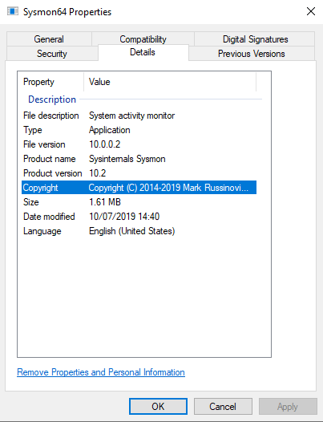
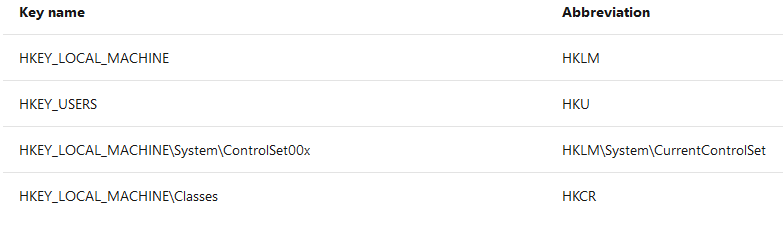
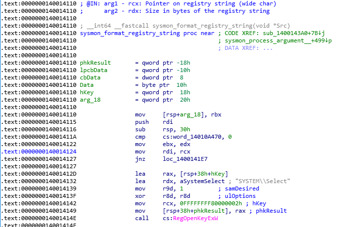
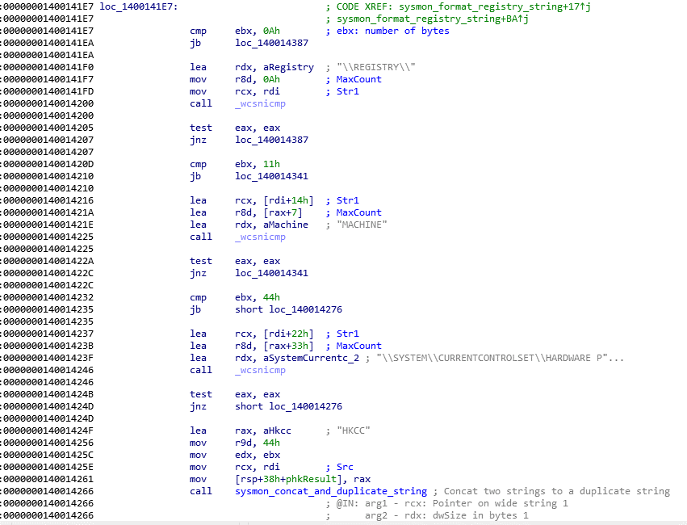

A Sysmon bug into the abbreviated versions of registry root names
=================================================================

*by Nicolas Delhaye, Vulnerability Researcher [@_Homeostasie_](https://x.com/_homeostasie_)*

# Introduction
Sysmon is a widely known and powerful tool that could be used as an EDR. Through this short analysis, a programming mistake has been identified when Sysmon converts the registry root key names to their abbreviations. Even if this bug does not seem to lead to a vulnerability, it is interesting to describe it.

First, some useful information:

- Type of issue: Confusion between a size in characters and in bytes
- Product version: Sysmon 10.2
- Log RegistryEvent (Object create and delete) – Event ID 12
- This issue does not have a security impact 

Version ***Sysmon.exe*** 10.2:



# Description of the bug
Sysmon uses the Event ID 12 (RegistryEvent) to log the creation/deletion of registry key and value. One way is to use abbreviated versions of Registry root key names, with the following mappings:



A programming mistake occurs when ***Sysmon*** converts the registry root key names to their abbreviations.

The function that converts the registry root key name takes two arguments as below:

- The first is a pointer on the wide-character registry key name
- The second is the size in bytes of the registry key name



In this function, several comparisons, relying on *_wcsnicmp* function, occur to determine if the registry root key name is HKLM, HKU, HKCC, HKCR and so on. Then before each comparison, the size of the registry key name is compared with a minimal size, corresponding to the size of the registry string to compare. **However these checks compare a size based on the number of characters (wide char, i.e. 2 bytes) with a size in bytes**. This can lead to some confusion.

What happens in practice is that many registry key names are unnecessarily compared. We would have thought that a read out of bound occurs but this  is not the case. Actually, the comparison ends if a terminating null character is reached, in either string before the numbers of characters are compared.

Below, what happens when “Sysmon “attempts to convert a registry root key name to HKCC.

HKCC is the abbreviation of *\REGISTRY\MACHINE\SYSTEM\CURRENTCONTROLSET\HARDWARE PROFILES\CURRENT* with:

- *\REGISTRY\* whose size is 0x0A wide characters, i.e. 0x14 bytes
- *MACHINE* whose size is 0x07 wide characters, i.e. 0x0E bytes
- *\SYSTEM\CURRENTCONTROLSET\HARDWARE PROFILES\CURRENT* whose size is 0x33 wide characters, i.e. 0x66 bytes

=> A total of 0x44 wide characters, i.e. 0x88 bytes

We can see these comparisons in the following screenshot:



In order to illustrate this behaviour, we put the following breakpoint to display the size and the string to compare:

```
bp sysmon.exe+14246 “.printf \”[format_registry_string]\\nSize of registry string: 0x%x\\nRegistry string: %mu\\n\\n\”, @ebx, @rcx; gc;”
```

This breakpoint is set at the 0x140014246 address, corresponding to the location where a “_wcsnicmp” occurs with the string *\\SYSTEM\\CURRENTCONTROLSET\\HARDWARE P*.

Now, if we attempt to create and modify the H*KEY_LOCAL_MACHINE\SYSTEM\12345678* registry key name, we obtain this debug trace:

```
[format_registry_string]
Size of registry string: 0x44
Registry string: \REGISTRY\MACHINE\SYSTEM\1234567
```

We notice right away that this input registry key name should not be compared with the *\REGISTRY\MACHINE\SYSTEM\CURRENTCONTROLSET\HARDWARE PROFILES\CURRENT* string. Indeed, the previous checks on the size should have prevented this comparison. However, due to the confusion, it is not the case.

The *\REGISTRY\MACHINE\SYSTEM\12345678* registry key name is composed of:

- *\REGISTRY\* whose size is 0x0A wide characters, i.e. 0x14 bytes
- *MACHINE* with whose size is 0x07 wide characters, i.e. 0x0E bytes
- *\SYSTEM\12345678* whose size is 0x10 wide characters, i.e. 0x20 bytes

=> A total of 0x21 wide characters, i.e. 0x42 bytes

Oddly, despite the confusion between a size in characters and in bytes, the size of this registry key seems to be 0x42 bytes and not 0x44 as my breakpoint shows us. We could assume that the null character is also taken into account.

In conclusion, Sysmon is a well-designed tool, involving few software components. An executable service and a minimalist driver are needed for the effective operation. Then, we quickly noticed that a security development has been taken into account. Obviously, this is not surprising. Nevertheless, any software has bugs, more or less critical for the product and the end user security. Microsoft has rightly determined that this submission does not meet the bar for security servicing. Actually, exploitation does not seem possible!  Only a loss of performance occurs. Finally, a bug fix could emerge in the next days.