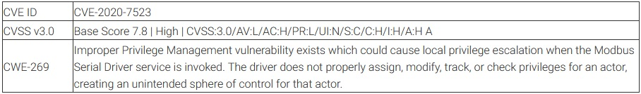
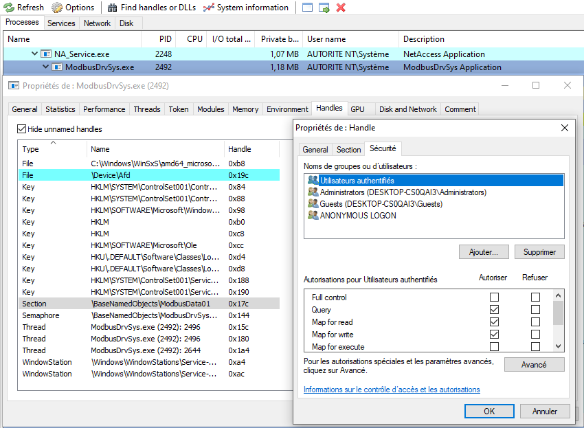

Abusing a shared memory on the Schneider Electric Modbus Serial Driver
=====================================
*CVE-2020-7523 (Local Privilege Escalation)*
-------------------------------------------

*by Nicolas Delhaye, Vulnerability Researcher [@_Homeostasie_](https://x.com/_homeostasie_)*

# Introduction
This vulnerability report is intended to demonstrate how the *EcoStruxure Control Expert* is prone to an arbitrary file write which results in a Local Privilege Escalation (LPE). An attacker could exploit this vulnerability to take full control of an affected system. This issue comes from a Schneider service, named ***ModbusDrvSys.exe***, which runs with ***Authority NT/System*** rights and does not have properly assigned permission on its shared memory. We would like to thank Schneider Electric for our mutual exchanges and for fixing this vulnerability as quickly as possible without impacting the end customer.

First of all, the Schneider Electric Modbus Serial Driver is a component widely used in several Schneider products as described in the SEVD_2020-224-01 notification **[1]**. In our case, we have encountered it as part of the *EcoStruxure Control Expert* product (formerly known as *Unity Pro*). The latter is a unique software platform aimed to increase design productivity and performance of a Modicon M340, M580, Momentum, Premium, Quantum and Quantum Safety applications **[2]**. Such software is deployed on a Microsoft Windows machine which is called an engineering workstation. Generally, only this station and the OPC Factory Server (OFS) would communicate with a Programmable Logic Controller (PLC). This makes them a valuable target for malicious actors who attempt to compromise a Schneider ICS environment. For example, the next steps could be to infiltrate in-depth inside the network or take control of a PLC through a communication channel as described in a previous article *Applying a Stuxnet Type Attack to a Modicon PLC* **[3]**. 

Through this article, we will see that it is not straightforward to reach the final goal because we will need to:

- Properly abuse the shared memory by locating some offsets to patch;
- Find a way to control data to overwrite the file;
- Bypass a restriction on the length of file name to overwrite;

Note:This analysis has been achieved as part of an advanced ICS security training by Airbus CyberSecurity.

# Vulnerability Analysis


## Description
The vulnerability is located in ***ModbusDrvSys.exe*** service which is responsible for managing the Modbus Communication.

The vulnerability was originally found on *Unity Pro S 12* and *Unity Pro S 13.1*, Schneider has since confirmed that all the newer versions including the *EcoStruxure Control Expert* are affected.

Please see the figure below, which highlights the version used throughout this vulnerability analysis:


First of all, the Modbus driver executable is an essential component which is required to exchange data with PLC platforms over a serial link. Actually, *Unity OSLoader* application uses MODBUS01 (Modbus port) or MBPLUS02 (Modbus Plus port) as a communication driver to upgrade a device. This serial communication is set up through a *MODBUS Driver* application, named ***ModbusDrv.exe***. 

Please see the figure below, which illustrates how to configure the serial communication from this application:


The ***ModbusDrvSys.exe*** service exposes two communication mechanisms:

- A shared memory, named ***ModbusData01***, which provides a way to update in real time the serial settings. This is mainly used by the ***ModbusDrv.exe*** application;
- A listening TCP socket (27700) which allows to receive Modbus data via TCP before being transmitted to the serial link;

By default, the *MODBUS Driver* application maintains a predefined list of COM Port from COM1 to COM4. Once selected, the name of the COM port will be set in the *ModbusData01* shared memory. Later, the ***ModbusDrvSys.exe*** service will open it for establishing a serial communication.

Unfortunately, neither control mechanism is implemented nor any security rights are applied on this shared memory. Such a programming choice allows any authenticated user to perform read and write operations.

Further, we will see how an exploitation can leverage this shared memory to gain a local privilege escalation. This scenario relies on an especially executable which will run with standard user rights and will be designed to:

- Access the shared memory and modify the COM port name to an arbitrary file name; 
- Send data on the local TCP port (27700) in order to coerce the ***ModbusDrvSys.ex***e service to open the arbitrary file and to convey this data to it;

Please see the figure below, which highlights the shared memory involved as part of the ***ModbusDrvSys.exe*** service:



Note the ***ModbusDrvSys.exe*** service running with ***Authority NT/System*** rights which handles a section named *\BaseNamedObjects\ModbusData01* and the security rights applied on this shared memory.

Please, see the figure below, how to set the security rights on this shared memory from a disassembly view:


What we can notice from the above figure is:

- *bDaclPresent* parameter set to TRUE;
- *pDacl* parameter set to NULL.  A NULL DACL assigned to the security descriptor means all access to the object is allowed; 

Reading remarks before using an API and more on Windows allow preventing many security issues. Please see the figure below, these are applied on the *SetSecurityDescriptorDacl()* **[4]** function:


In the next paragraph, we will see step by step how to develop a partial program to abuse this vulnerability.

# Designing a Proof of Concept (PoC)
One way to design a PoC relies on the use of an executable which will achieve the following steps:

1. Open and map the shared memory ***ModbusData01***;
1. Modify some fields of the shared memory as follow:Rename the “COM1” file to an arbitrary file at offset 0x468;  
   Increment the value at offset 0x44C: This prevents to release the arbitrary file handle before writing data coming from the TCP channel;
1. Open a socket on the local address 127.0.0.1:27000;
1. Send TCP data according to a specific protocol to write data into the arbitrary file as if was the serial port;

At this point, we will focus on how to implement these different steps based on our brief software analysis and with a bit of reverse-engineering.

## Abusing the shared memory
After opening and mapping the shared memory, we need to alter some fields of the shared memory. Mainly two offsets are concerned:

- 0x468 which is the location of the serial port name;
- 0x44C which is a count reference on the handle of the serial port name;

The first offset comes from a glimpse on the shared memory whereas the second relies on reverse-engineering. This PoC will require two local network connections. The first allows the Schneider service to open the arbitrary file and the second to send data to it. However, we must increment a reference count to prevent the handle of the filename to be released between these two requests.

Please see the figure below, a partial dump of the shared memory before any modification


Note the string *COM1* which will be used for the serial communication. 

Please see the figure below, a partial dump after altering the shared memory with an arbitrary file name:


From the above dump, we have replaced the *COM1* string with a *c:\mysqld.exe* string. However, we have a significant constraint on the file name that I have not described so far. Implementation of the ***ModbusDrvSys.exe*** service only allows you to open a 13 bytes-length filename. 

Please see the figure below, a screenshot of the disassembled code highlighting this limitation:


Before opening a serial port, the file name is built from the format string "\\.\%s". According to the screenshot above, the maximum size is 20 bytes. If you take into account the prefix "\\.\", the remaining file size is 16 bytes. Furthermore, we also need to delete the volume prefix, for example "c:\". Finally, the maximum permitted size is 13 bytes to overwrite a filename. Such a limitation is not surprising when it comes to short names like COM1, COM2 and so on.

How can we bypass this restriction? Thinking about *NTFS junctions and object manager symbolic links* sound pretty good. This technique **[3]** has been described by @clavoillotte and relies on the James Forshaw tools. In our case study, it will work very well.

## Handling the socket

Some reverse-engineering led me to figure out that writing data in the listen TCP port (27700) is the mechanism involved to communicate with a serial link. This port is managed by the ***ModbusDrvSys.exe*** service which finally acts as a proxy. Thus, we will use this channel for overwriting an arbitrary file with data under our control.

Please see the figure below, a disassembly code which highlights a close link between the recv() function and the serial port as part of the TCP receive thread:


The careful reader will notice again the offset 0x468 corresponding to the location of the serial port name, that is the offset we have overwritten to achieve an arbitrary file write as described in a previous figure.

At this time, we are aware that a simple TCP connection on the 27700 port allows writing arbitrary data into a sensitive file. However, TCP data need to be sent according to a proprietary network protocol. After observing the network traffic and thanks to some reverse-engineering, we readily retrieve the structure of a message. 

Please see the figure below, an *IP_COM_HEADER_T* structure which is a representation of this protocol:

```c
#pragma pack(1)
typedef struct IP_COM_HEADER_T
{
      WORD wUnk1;
      WORD wUnk2;
      WORD wDataSize;
} IP_COM_HEADER_T;

typedef struct IP_COM_MSG_T
{
      IP_COM_HEADER_T header;
      CHAR cbData[1042];
}IP_COM_MSG_T;
#pragma pack()
```

Two fields are important:

- *wDataSize* field which is the size of the useful data, that is without considering the header size;
- *cbData* field which is the raw data sent to the serial port;

Then, we should deal with another restriction for a successful exploitation. This is applied on the amount of data which could be sent through the TCP channel. Actually, the software allows you to receive a maximum of 1042 bytes. Hence, we could not write more than this size to the arbitrary file. However, it will be enough to make interesting things.

# Demonstration
A proof of concept (PoC) has been developed to demonstrate the impact of the vulnerability by targeting the following environments:

- *Unity Pro S 12* deployed on Windows 7 Home Basic 64-bit with Service Pack 1
- *Unity Pro S 13.1* deployed on Windows 10 Professional 1903 64-bit

In a real scenario of local privilege escalation, the first step consists of identifying an interesting file to overwrite on a file system. Considering a configuration file or an executable file started with high privileged rights will be a good starting point.

Though, in our disclosure context, the proof of concept will merely focus on the ability to achieve an arbitrary file write. Targeting a specific executable or using a generic approach is left to the reader. Consequently, if we write data into a specific file with security rights denying write operations for a non-privileged user, we will consider that it will be sufficient. 

Please see the figure below, a screenshot on the security properties of a *restricted* file:


Obviously, if we attempt to modify and save the *restricted* file from an account with standard rights, we will get a windows pop-up displaying the "access denied" message or something similar.

At this point, we can now launch our exploit which will overwrite the content of the *restricted* file with our controlled data. Please see the figure below, results of this proof of concept:


We have successfully modified the content of this file.

# Conclusion
Since this vulnerability is based on a design issue, developing an exploit will be reliable. However, it was not easy to turn into a privilege escalation because we have to understand a part of the software architecture such as the link between the TCP channel and data written into the serial COM. Then, abusing the shared memory has required some reverse engineering to figure out how to coerce the program to open the targeted file. Finally, once this goal is reached, we had to overcome some restrictions on the full path name and the amount of data permitted throughout the overwriting.

Today, Schneider has fixed this vulnerability and any customers can upgrade the Modbus driver on their own rather than waiting for a bundle in the next product release.

# Disclosure Timeline
Airbus CyberSecurity follows the widely accepted 90-day vulnerability disclosure policy; meaning Airbus CyberSecurity won’t engage any public communication about the reported vulnerability during that time frame without any prior public communication or fix. Please note that Airbus CyberSecurity’s general position is that as soon a working and active relationship is established, there is no need to blindly push for the 90-day vulnerability disclosure if it’s not necessary.

Schneider reacted quickly to confirm this issue and due to some constraints, more time than expected has been required to fix it. However, thanks to Schneider for our mutual exchanges and for informing us on the progress status regularly.

*January 28th, 2020*: Vulnerability is reported to Schneider Electric

*January 29th, 2020*: Schneider Electric creates the case SE ref ID 1905 for this report

*February 21th, 2020*: Schneider Electric confirms the vulnerability

*April 20th, 2020*: Schneider Electric requires more time to fully fix this issue

*June 17th, 2020*: Schneider Electric plans to provide a fix at the end of June

*July 16th, 2020*: Schneider Electric plans to provide a fix on 11th of August

*August 11th, 2020*: Vulnerability is fixed under SEVD-2020-224-01 ***[1***] and CVE-2020-7523

*August 21st, 2020*: Airbus publishes the report associated with the CVE-2020-7523

# References
**[1]** “SEVD-2020-224-01 – Schneider Electric Security Notification: Schneider Electric Modbus Serial Driver”  
https://www.se.com/ww/en/download/document/SEVD-2020-224-01

**[2]** EcoStruxure™ Control Expert  
https://www.se.com/sg/en/product-range-download/548-ecostruxure%E2%84%A2-control-expert/

**[3]** “Applying a Stuxnet Type Attack to a Modicon PLC” by Flavian Dola  
https://airbus-cyber-security.com/fr/applying-a-stuxnet-type-attack-to-a-modicon-plc/

**[4]** “SetSecurityDescriptorDacl function” by MSDN  
https://docs.microsoft.com/en-us/windows/win32/api/securitybaseapi/nf-securitybaseapi-setsecuritydescriptordacl

**[5]** “An introduction to privileged file operation abuse on Windows” by @clavoillotte  
https://offsec.almond.consulting/intro-to-file-operation-abuse-on-Windows.html