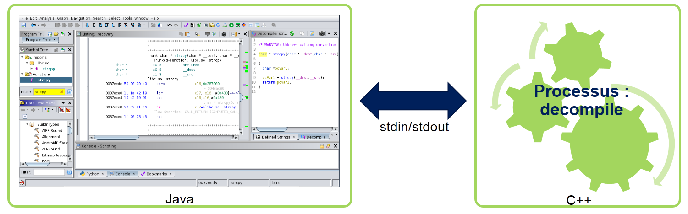

Ghidralligator : Emulate and fuzz the embedded world
==================================================

*by Flavian Dola, Vulnerability Researcher [@_ceax](https://twitter.com/_ceax)*

Fuzzing is one of the most favored techniques used by researchers to discover vulnerabilities.

In this article, we introduce [Ghidralligator](https://github.com/airbus-cyber/ghidralligator), a newly designed tool. Ghidralligator is an emulator built upon Ghidra, capable of emulating a wide range of CPU architectures. Additionally, it can be integrated with AFL to enable snapshot fuzzing with code coverage functionality. Ghidralligator serves as the successor to *[afl_ghidra_emu](https://github.com/airbus-cyber/afl_ghidra_emu)*.

For a comprehensive understanding of afl_ghidra_emu and fuzzing with code coverage, we recommend reading our [previous article](https://github.com/airbus-cyber/blogpost/tree/main/fuzzing-exotic-arch-with-afl-using-ghidra-emulator).

# Ghidra Internals

[Ghidra](https://ghidra-sre.org/) is a reverse engineering tool developed by the NSA and released in 2019. It supports numerous CPU architectures. In *afl_ghidra_emu*, we utilized Ghidra's emulation features. However, we encountered subpar performance due to Ghidra being a large software primarily designed in Java, which is not optimized for optimal emulation performance.

By delving deeper into Ghidra, we can identify two main components:
* The HMI (Human-Machine Interface), which is designed in Java.
* The process decompile, which is designed in C++.

The process decompile handles low-level tasks such as disassembly and decompilation. The HMI communicates with the process decompile through stdin/stdout.

As a result, the C++ source code for the decompile component can be reused in another project for tasks like disassembly, decompilation, and emulation!

In Ghidra, this C++ source code is referred to as libsla. Additional information can be found in [Guillaume Valadon's talk](https://static.sstic.org/rumps2020/SSTIC_2020-06-04_P11_RUMPS_11.mp4) (in French).

# Ghidralligator

[Ghidralligator](https://github.com/airbus-cyber/ghidralligator) is developed in C++ and is based on the Ghidra libsla. Compared to afl_ghidra_emu, it offers significantly improved execution speed.

Ghidralligator leverages the intermediate language [PCODE](https://fossies.org/linux/ghidra/GhidraDocs/languages/html/pcoderef.html) to achieve independence from CPU architectures. As a result, it can emulate any architecture supported by Ghidra.

Here are the features of Ghidralligator:
* Integration with [AFL](https://github.com/AFLplusplus) for code coverage analysis.
* Snapshot fuzzing.
* Detection of heap corruption issues such as out-of-bounds read/write operations, use-after-free, double-free, reading uninitialized memory, and read/write/execute access violations.
* CPU architecture independence.

Ghidralligator can be downloaded at https://github.com/airbus-cyber/ghidralligator.

