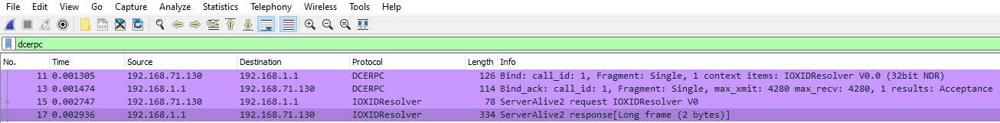
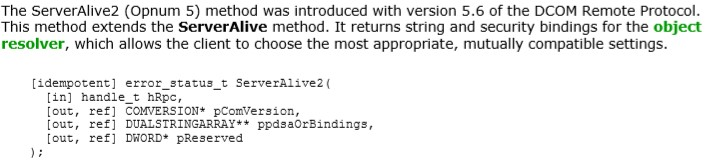
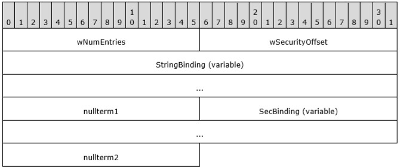
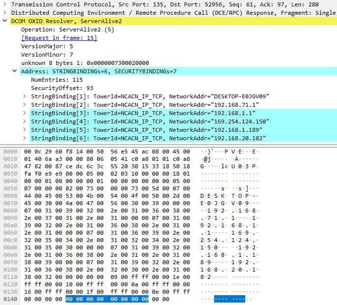
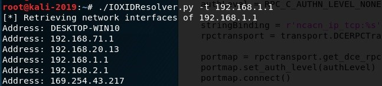

The OXID Resolver [Part 1]
==========================
*Remote enumeration of network interfaces without any authentication*
---------------------------------------------------------------------

*by Nicolas Delhaye, Vulnerability Researcher [@_Homeostasie_](https://x.com/_homeostasie_)*

# Introduction
Performing pentests or red team assessments require at least four stages, including reconnaissance, scanning, gaining and maintaining access. As part of the scanning stage, the attacker (or threat actor) needs to identify, as complete as possible, the internal network architecture. This (sub) network cartography allows the attacker to discover the largest number of potential machines to compromise. The main goal will often be to infiltrate the enterprise in-depth. Collecting such network information relies on several methods, for example a local/remote DNS enumeration or gathering network information as soon as a machine is compromised. Finally, acquiring network cartography is not as easy as it seems and all methods are welcomed to gather this information.
This article series will be composed of two parts:
- The first part will explain how to achieve a ***remote enumeration of network interface***s on a Windows OS machine ***without any authentication***. We will show that this is done from a RPC method which is held by the ***IOXIDResolver interface***. This interface is part of the DCOM remote object activation. A python script and the methodology to implement such a tool in native code will be delivered. 

- The second part will explain why such RPC is used inside a DCOM environment. This involves diving into the ***OXID Resolver component***. The latter requires to understand some DCOM concepts such as transparency, marshalling and object reference. This part will be described in the next blog post.

# The offending RPC method
When a researcher is looking for weaknesses in a DCOM-based product, an approach is to examine traffic flow between the server and the client. Using a tool to capture  network communication is a good idea. While dissecting the exchanged frames, the researcher will probably see both an ***IOXIDResolver*** interface and the RPC methods e.g. *SimplePing()* and *ServerAlive2()*. 
Please see below network capture in the following figure:



First, the DCE-RPC request allows you to bind with the ***IOXIDResolver*** interface. It’s IID is *99fcfec4-5260-101b-bbcb-00aa0021347a*.

Secondly, we are going to focus on the ***ServerAlive2()*** method. The latter is part of IOXIDResolver interface.

According to the MS-DCOM [1] documentation, the ***ServerAlive2()*** method is described in Figure 2 below:



The input/output parameters have the following meanings:
- ***hRpc***, which is an RPC binding handle
- ***pComVersion***, which contains the COMVERSION of the object resolver
- ***ppdsaOrBindings***, which contains the string and security bindings of the object resolver
- ***pReserved***, which must contain zero and must be ignored by the recipient

In our context, the ***ppdsaOrBindings*** is the output parameter of interest. Its type is an array of DUALSTRINGARRAY which is defined as follows in the following figure:



The protocol uses this structure as a fundamental means of specifying RPC addressability and security information for either an object resolver or an object exporter.

Please see below screenshot in the following figure of the returned DUALSTRINGARRAY from the ***ServerAlive2()*** response:



In the current test, the remote OXID resolver returned six DUALSTRINGARRAY entries composed of:
- The network machine name
- Five IP addresses

From this response, a typical developer is able to implement a tool to collect these bindings. 

# Tools
The main purpose is to retrieve network or string bindings of the object resolver, not to be confused with the endpoint bindings. The latter is used to reach an object exporter and can be retrieved from a conventional call to the *ResolveOxid()* method. Obtaining an OXID requires to be authenticated. However, the *ServerAlive2()* method, held by the *IOXIDResolver* interface, also provides a part of these bindings. That is the remote IP adresses without a TCP port number. This time, owning an OXID is no longer necessary, no authentication is required.

## Python script
Relying on *Impacket* **[1]** seems to be the fastest way to implement this tool. Indeed, *Impacket* has a collection of Python classes for working with network protocols.

Please see below source code of a simple tool that collects remote network interfaces:

```Python
#!/usr/bin/python

import sys, getopt

from impacket.dcerpc.v5 import transport
from impacket.dcerpc.v5.rpcrt import RPC_C_AUTHN_LEVEL_NONE
from impacket.dcerpc.v5.dcomrt import IObjectExporter

def main(argv):
    try:
        opts, args = getopt.getopt(argv,"ht:",["target="])
    except getopt.GetoptError:
        print 'IOXIDResolver.py -t <target>'
        sys.exit(2)

    target_ip = "192.168.1.1"

    for opt, arg in opts:
        if opt == '-h':
            print 'IOXIDResolver.py -t <target>'
            sys.exit()
        elif opt in ("-t", "--target"):
            target_ip = arg

    authLevel = RPC_C_AUTHN_LEVEL_NONE

    stringBinding = r'ncacn_ip_tcp:%s' % target_ip
    rpctransport = transport.DCERPCTransportFactory(stringBinding)

    portmap = rpctransport.get_dce_rpc()
    portmap.set_auth_level(authLevel)
    portmap.connect()

    objExporter = IObjectExporter(portmap)
    bindings = objExporter.ServerAlive2()

    print "[*] Retrieving network interface of " + target_ip

    #NetworkAddr = bindings[0]['aNetworkAddr']
    for binding in bindings:
        NetworkAddr = binding['aNetworkAddr']
        print "Address: " + NetworkAddr
        
if __name__ == "__main__":
   main(sys.argv[1:])
```

The above code does not require any user credentials. This is a powerful and useful trick when a pentester attempts to get a network cartography.

Please see below results of the tool when targeting a Windows 10 Pro version 1909:



## Porting to native code
Implementing this tool in native code is more difficult and time-consuming. This requires experimenting with the MIDL compiler and native functions such as:
- *RpcStringBindingCompose()* which creates a string binding handle
- *RpcBindingFromStringBinding()* which returns a binding handle from a string representation of a binding handle

The first step is to retrieve the *IObjectExporter.idl* from appendix A in **[2]**. Ideally, this IDL file should be added into a Visual Studio Project. Once compiled, the two following files are generated:
- *IObjectExporter_c.c*, which is the client stub
- *IObjectExporter_h.h*, which is the header containing definitions of all data types and operations declared in the IDL file

From the *IObjectExporter_h.h*, the function prototype of ServerAlive2 is defined as follows:

```c
/* [idempotent] */ error_status_t ServerAlive2( 
    /* [in] */       handle_t hRpc,
    /* [ref][out] */ COMVERSION *pComVersion,
    /* [ref][out] */ DUALSTRINGARRAY **ppdsaOrBindings,
    /* [ref][out] */ DWORD *pReserved);

```
The second step is to call the *RpcStringBindingCompose()* function to create a string binding handle. This involves to define the *protseq*, *NetworkAddr* and *Endpoint* parameters. For example, these values can be set as follows:
- *Protseq*: ncacn_ip_tcp
- *NetworkAddr*: 192.168.1.1 (the remote OXID Resolver)
- *Endpoint*: 135

Finally, the last step will be to call the *ServerAlive2()* method.

# Conclusion
During this article, a pentester could use this RPC method to collect the network interfaces remotely. Only Windows machines with the version 5.6 of DCOM Remote Protocol can be abused. This version occurred in June 2008. 

However the curious reader will probably enjoy understanding what happens. DCOM is a complex technology. Discovering the goal of the OXID Resolver allows you to grasp interesting DCOM concepts. Therefore, as the OXID Resolver is one of the most important component to access a remote service and the next part will focus on it.

# References
**[1]** Impacket  
https://github.com/SecureAuthCorp/impacket

**[2]** [PDF] MS-DCOM:  Distributed Component Object Model (DCOM) Remote Protocol  
https://winprotocoldoc.blob.core.windows.net/productionwindowsarchives/MS-DCOM/%5bMS-DCOM%5d-171201.pdf