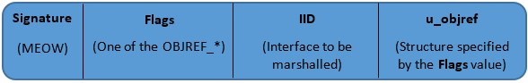
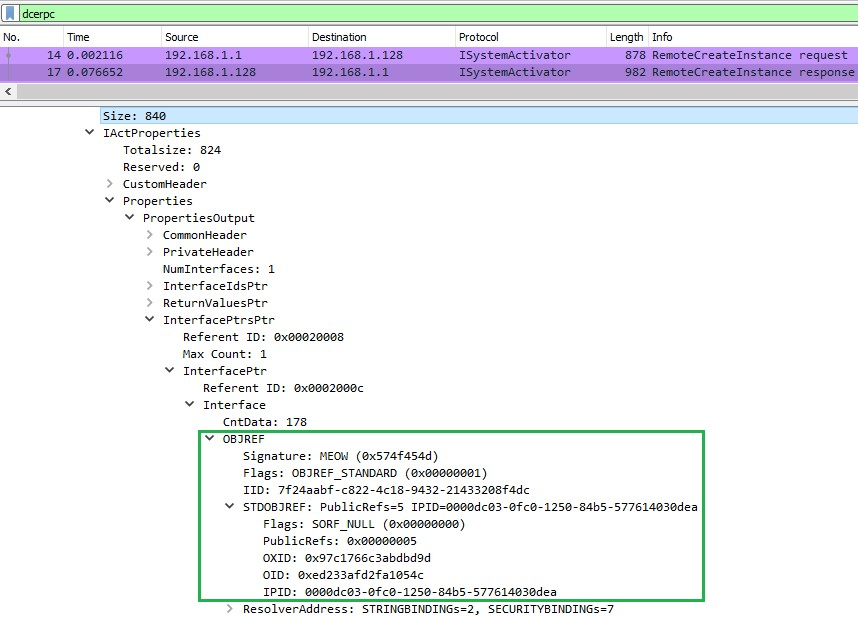

The OXID Resolver [Part 2]
==========================
*Accessing a Remote Object inside DCOM*
---------------------------------------

*by Nicolas Delhaye, Vulnerability Researcher [@_Homeostasie_](https://x.com/_homeostasie_)*

# Introduction
In the previous OXID Resolver Part 1 article **[1]**, a way to remotely enumerate the network interfaces on a recent Windows OS machine has been described. This method does not require the knowledge of user credentials and relies on the *ServerAlive2()* RPC method. The latter is held by the *IOXIDResolver* interface.

This article is dedicated to the OXID Resolver which is part of the accessibility of the remote object in DCOM. Understanding what this component is for, requires discovering or reviewing some DCOM concepts such as:
- Transparency
- Object Reference with Standard Marshalling
- Remote activation
- OXID Resolver Interface

*<u>Disclaimer</u>: This article is not intended to be a reference on DCOM. Some articles **[2]** or books **[3] [4]** already cover this in-depth complex technology.*

# OXID Resolver inside DCOM
## Transparency
Transparency inside DCOM is an essential concept that the reader must understand. DCOM is an extension of Microsoft's Component Object Model (COM) across the network. It allows the use of all COM functions between several computers over the network. To the client and the server component, the distributed calls are seamless, the client never has to change how it calls the component and the component does not know if the client is on another machine.

More specially, it concerns the ability to remotely retrieve an interface pointer of object B from a method argument of object A. All underlying mechanisms (remote activation and remote invocation) are seamless from a user point of view. This approach is called Object RPC (ORPC). It means that a given interface pointer must have the same meaning both on the client and the server. This is made possible with the marshalling of the interface pointer which appends additional information. In the next chapter, we will see what it consists of. 

## Object Reference with Standard Marshalling
First, a thread that uses COM is called an apartment. An apartment can be seen as a specific execution context dealing with object’s interface pointers. It mainly represents two kinds of threading models:
- Single-Threaded Apartment (STA)
- Multi-Threaded Apartment (MTA)

A client should unmarshall the interface pointer to get its local representation before any indirect calls towards the remote objects are involved. For this purpose, DCOM relies on the Object Reference (OBJREF).

An OBJREF can describe four types of object:
- OBJREF_STANDARD
- OBJREF_CUSTOM
- OBJREF_HANDLER
- OBJREF_EXTENDED

Differences between these four objects are not explained but OBJREF_STANDARD is the most commonly used. Therefore, this article will focus on this one.

Please see figure below, which shows the OBJREF structure:



Such a structure provides the following information:
•	The ***MEOW*** string indicates we are dealing with Object Reference
•	The ***Flags*** field defines what type of object is referenced by the ***u_objref*** field
•	The ***IID*** field specifies the remote interface that will be used

Right away, there is no information describing the execution context (apartment) holding the remote object’s interface.  The latter is included into the ***u_objref*** field. 

So, let’s focus on the standard marshalling, that is the STDOBJREF structure of an OBJREF_STANDARD.

Please see the figure below, which shows the STDOBJREF structure:


This structure is composed of three major fields:
- The ***OXID*** (Object Export ID - 64-bit) which identifies an apartment that exports an interface. It is unique within a given machine and is managed by the OXID Resolver service
- The ***OID*** (Object ID - 64-bit ID) which identifies a stub manager on the object side. It is unique within a particular apartment
- The ***IPID*** (Interface Pointer ID - 128-bit) which represents a unique interface pointer ID to identify an interface stub

In fact, the ***OXID/OID/IPID*** combination uniquely represents a marshalled object’s interface between a client and a server over the network.

Know that the OXID is generated as soon as the first interface pointer is exported from the server apartment. Thus, the OXID Resolver can maintain an OXID table with the corresponding network bindings. Later, this allows the handling of incoming activation requests and resolves an OXID to the right bindings. 

The ***saResAddr*** is an <u>optional</u> and interesting field. This OBJREF_STANDARD structure includes two bindings:
- The network bindings which provide network information (protocol sequences and network addresses) to reach an OXID Resolver. This OXID Resolver is located on the machine exporting an object’s interface
- The security bindings that provide security information on the object’s interface. For example, authentication and authorisation information

# Remote activation
COM is able to seamlessly activate COM servers both locally and remotely. This is done through a Windows service, named *RpcSs* (*Remote Procedure Call*), as part of the SCM (Service Control Manager).  Note that there is only one SCM per machine.

From the Windows Services application, the *RpcSs* service has the following description:

```
The RPCSS service is the Service Control Manager for COM and DCOM servers. It performs object activations requests, object exporter resolutions and distributed garbage collection for COM and DCOM servers.  
If this service is stopped or disabled, programs using COM or DCOM will not function properly. It is strongly recommended that you have the RPCSS service running.
```

Its command line is the following:

```
C:\Windows\system32\svchost.exe -k RPCSS -p
```

As the RPCSS acronym suggests, this service runs the RPC Sub-System. But is also responsible for the COM Service Control Manager, which is an essential component of the DCOM infrastructure. Actually, how to use a remote COM component if it is not started or without any knowledge of how to connect to it. The rest of the article will answer these questions.

For a better understanding of mechanisms involved, the explanation will rely on the following configuration:
- Machine A (192.168.1.1) which will host a COM client
- Machine B (192.168.1.128) which will host a COM server. This one exports the *CCOMServer* object with the CLSID *6AE24C34-1466-482e-9407-90B98798A712* and the *ICOMServer* interface with the IID *7F24AABF-C822-4c18-9432-21433208F4DC*

In this scenario, Machine A attempts to remotely retrieve an interface pointer on the *ICOMServer* interface that is held by the Machine B. From a developer point of view, the *CoCreateInstanceEx* API extends the *CoCreateInstance* API in order to instantiate remote objects through an additional input parameter, that is the *COSERVERINFO* structure. The latter gets information about the server. 

The *CoCreateInstanceEx()* is part of the hidden side of DCOM.  It involves the use of the following interfaces:
- The *IRemoteActivation* or the *IRemoteSCMActivator* (also known as *ISystemActivator*)
- The *IOXIDResolver*

While *CoCreateInstanceEx()* API is executed, the local SCM (Machine A) contacts the remote SCM (Machine B) by calling:
- The *RemoteActivation()* method of *IRemoteActivation* if COM version is less than 5.6
- The *RemoteCreateInstance()* method of *IRemoteSCMActivator* otherwise

Please see the figure below, which shows an activation request between machines A and B which runs on Windows 10 1903:


Highlighted in green borders, we can see that the *RemoteCreateInstance()* request includes both the CLSID and the IID. Indeed, a COM client is attempting to get the *ICOMServer* exported by the remote *CCOMServer* object. This is done through a raw RPC request on the TCP destination port 135. Then, the remote SCM becomes responsible of the *CCOMServer* object activation. If the remote object is well activated, an interface pointer (OBJREF) will be marshalled from the server apartment to the client apartment. 

Please see the figure below, which shows the activation response from the RemoteCreateInstance() request:



As expected, whether the remote object exists and the activation rights are authorised, the client receives an OBJREF back.  This one references a STDOBJREF. Machine A is now informed of the remote interface from the OXID, OID and IPID. COM version can also be grabbed as well as the optional bindings to reach the object exporter.

According to the MS-DCOM **[5]** documentation:

```
When a client receives an OXID as part of an object reference, it needs to determine the RPC binding information required to communicate with the remote unknown object of the object exporter. The client uses the OXID resolution mechanism to achieve this. 
```

So, the next step is the ***OXID resolution***. We might expect to see a call to the *ResolveOxid()* RPC method over the network. In our case, this step has been bypassed because the OBJREF already contains the string binding of the endpoint. Hence, the downside is the local OXID Resolver could not cache this information to improve network traffic and time consumption when an identical request occurs.

Please see the figure below, which shows the endpoint bindings as part of the response of an activation request:


The string bindings are returned and the COM client is able to reach the object exporter. 

Please see the figure below, which shows a network capture which highlights a remote call (*call_id 2*):


Highlighted in green borders, we can see that the network connection is over the *192.168.1.128:49970* binding.

## The OXIDResolver Interface (*IObjectExporter*)
The OXIDResolver interface, formerly known as *IObjectExporter*, is a service that runs on every machine that supports COM+.  It is remotely used to reach the local object resolver and is composed of the following methods:


The *ResolveOxid()* and *ResolveOxid2()* methods provide string bindings that are necessary to connect with remote objects.

The *SimplePing()* and *ComplexPing()* methods are used to maintain the reference count on the remote object which is shared between the client and the server.

Finally, the ***ServerAlive2()*** (Opnum 5) method was introduced with version 5.6 of the DCOM Remote Protocol. This method extends the *ServerAlive()* method. It returns the string and the security bindings for the object resolver, which allows the client to choose the most appropriate, mutually compatible settings.

In the previous *OXID Resolver Part 1* article **[1]**, the ***ServerAlive2()*** method is used to remotely enumerate the network interfaces.

# Conclusion
Through this article, we discussed some interesting DCOM concepts used by the OXID Resolver component. The main purpose was to understand what the OXID Resolver is for and how it works, even if all the fine details cannot be provided about this complex technology.

Moreover, this standalone functionality is well entrenched in the Windows environments, that is why it will be difficult to avoid its use. For example, if a host machine is offering some RPC or DCOM services to a remote client. In this case, the remote enumeration of network interfaces previously described in Part 1 **[1]** could work for a long time.

Finally, a Part 3 that would dive deeper into the OXID Resolver internals is being discussed.

# References
**[1]** The OXID Resolver [Part 1] - Remote enumeration of network interfaces without any authentication  
https://airbus-cyber-security.com/the-oxid-resolver-part-1-remote-enumeration-of-network-interfaces-without-any-authentication/

**[2]** COM_in_Wine  
https://wiki.winehq.org/Wine_Developer%27s_Guide/COM_in_Wine

**[3]** Inside COM+: Base Services by Guy Eddon and Henry Eddon  
https://thrysoee.dk/InsideCOM+/

**[4]** Learning DCOM by Thuan L. Thai

**[5]** MS-DCOM:  Distributed Component Object Model (DCOM) Remote Protocol  
https://docs.microsoft.com/en-us/openspecs/windows_protocols/ms-dcom/4a893f3d-bd29-48cd-9f43-d9777a4415b0

