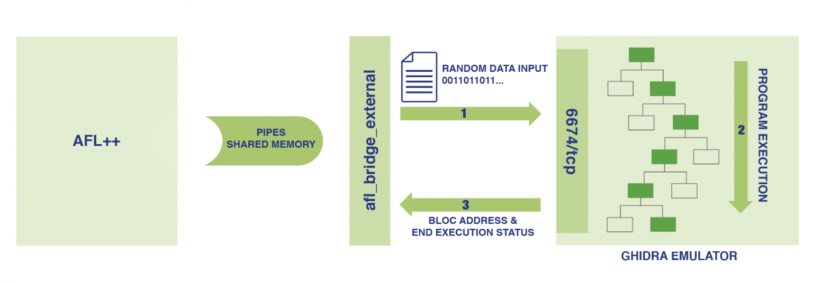
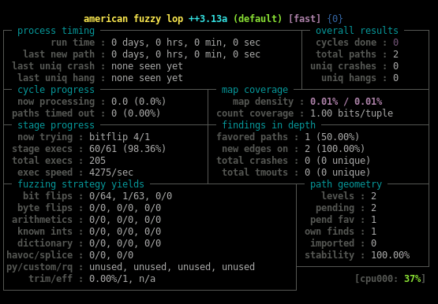
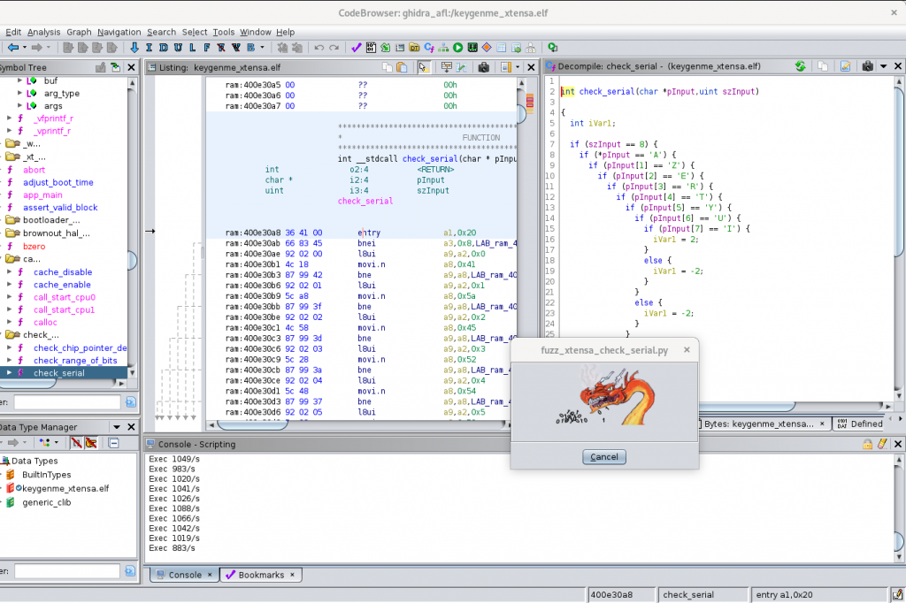

Fuzzing exotic arch with AFL using ghidra emulator
==================================================

*by Flavian Dola, Vulnerability Researcher [@_ceax](https://twitter.com/_ceax)*


# Note
[afl_ghidra_emu](https://github.com/airbus-cyber/afl_ghidra_emu) is no longer maintained and replaced by **[Ghidralligator](https://github.com/airbus-cyber/ghidralligator). Try it!**

# FUZZING

Fuzzing is a very popular and useful technique used by researchers to find vulnerabilities.

In this article, we are going to describe how we can use AFL++ and Ghidra emulation -engine to fuzz programs in embedded devices running on exotic architectures. This could be an alternative choice when it cannot be easily done using a supported emulator engine like Qemu or Unicorn.

In this context, we designed a new tool to interact with AFL++. From this new functionality, we can now implement a code coverage feature while fuzzing through external running program (for example, Ghidra emulation engine).

Finally, we will describe a use case example on a xTensa (ESP32) architecture.

In order to be more efficient in vulnerability discovery, researchers often use a fuzzing approach to highlight potentially exploitable bugs. In a nutshell, fuzzing consists of injecting “random” inputs into a program while monitoring it to detect any abnormal behaviours, like crashes or unexpected issues.

## Blind fuzzing 

There are many ways to fuzz a target. The first one is called “blind fuzzing”. In many cases, it is the easiest approach which merely consists of sending random data to a program or an embedded device until abnormal behaviour such as a crash, a delayed response or a configuration change occurs and so on.

To be as efficient as possible, “blind fuzzing” requires significant effort in reverse engineering. Indeed, we need to understand the expected input data format of the application in order to maximise the chance of finding vulnerabilities such as the size field, some function code field, CRC and so on. Without this preliminary work, it will be very unlikely to access a potentially vulnerable portion of code.

## Fuzzing with code coverage

Nowadays, “Fuzzing with code coverage” is the most relevant fuzzing approach to get interesting results. The main idea is to automatically supply new inputs to the fuzzing engine in order to execute the maximum of reachable code. So, in practice, every new execution path discovered leads to a new sample in which fuzzing mutations will occur. Originally, this approach was only used to fuzz source code because code coverage instrumentation should be added at the time of compilation. 

## American Fuzzy Lop (AFL)

AFL is one of most popular fuzzing options available. Originally developed by Michal “lcamtuf” Zaleswski, its successor AFL++ is nowadays maintained by a larger community.

AFL is able to fuzz black box programs with code coverage. To reach this goal, AFL depends on emulation engines like Qemu or Unicorn which collects coverage information (basic block address) before delivering it to AFL. For more information, please refer to [AFL documentation](https://lcamtuf.coredump.cx/afl/technical_details.txt). 

Typically, AFL and Unicorn are used on bare metal embedded devices. First and foremost, Unicorn is aimed to design instrumentation at emulation level, so it becomes easier to develop it (for example, hardware behaviour). For more information about AFL-Unicorn please refer to [this article](https://medium.com/@njvoss299/afl-unicorn-fuzzing-arbitrary-binary-code-563ca28936bf).

Unfortunately, Unicorn is still based on an old Qemu version and it currently supports a limited set of CPU architectures (ARM, ARM64 (ARMv8), M68K, MIPS, SPARC, and X86). So, how can we fuzz program using AFL on an unsupported architecture CPU?


# AFL with Ghidra emulator

In order to fuzz some piece of code from an “exotic” architecture, we are relying on AFL++, and on Ghidra to emulate its execution. We must implement the following functionality to profit code coverage benefits:

* A bridge between AFL++ and Ghidra emulator (*afl_bridge_external*);
* A Ghidra emulation instrumentation ([afl_ghidra_emu](https://github.com/airbus-cyber/afl_ghidra_emu)) which allows to receive input samples, and notify AFL++ about execution path;



*Figure 1: AFL Ghidra emulator PoC architecture*

All the code described can be retrieved from our github: [afl_ghidra_emu](https://github.com/airbus-cyber/afl_ghidra_emu)


# How it works

AFL++ runs a trampoline program (afl_bridge_external) which is in charge of forwarding samples to Ghidra emulation via a TCP socket (Ex: 127.0.0.1:6674/tcp)  

A python script in Ghidra (*fuzz_xtensa_check_serial.py*) is responsible for emulating code execution. It listens to a TCP socket (127.0.0.1:6674/tcp) and waits for input data coming from trampoline script.

As soon as the script receives input data, the emulation will be started. During the execution, the executed path addresses and the execution status are sent to *afl_bridge_external* using established TCP socket.

*afl_bridge_external* reports the execution status and execution path to AFL++ using pipes and shared memory. 

# Installation

* Install [AFL++](https://github.com/AFLplusplus/AFLplusplus)

* Clone afl_ghidra_emu directory
```bash
$ git clone https://github.com/airbus-cyber/afl_ghidra_emu.git
```

* Copy afl_ghidra_emu files to your ghidra script directory
```bash
$ cd ../..
$ cp -r afl_ghidra_emu/* $USER_HOME/ghidra_scripts/
```

# Example: Fuzzing Xtensa binary code

As an example, we made a keygenMe software compile for Xtensa architecture that you can download from [this link](https://github.com/airbus-cyber/afl_ghidra_emu/blob/master/examples/xtensa/bin/keygenme_xtensa.elf).

## Load in Ghidra

* Create a new project in Ghidra;
* Import file ./bin/keygenme_xtensa.elf (arch: Xtensa:LE:32);
* Open it in CodeBrowser and execute auto-analyze;
* Open Script Manager in “Window” submenu;
* Run script fuzz_xtensa_check_serial.py;

## Start Fuzz

* Make AFL workspace directories
```bash
$ mkdir input output
```

* Add first sample
```bash
$ echo –n “BBBBBBBB” > input/sample1.bin
```

* Start AFL++ with the trampoline program.
```bash
$ afl-fuzz -D -i input -o output afl_bridge_external 127.0.0.1 6674 20
```





 When AFL++ has detected a crash, we got the expected serial:

```bash
$ cat output/default/crashes/id*
AZERTYUI
 ```


# Stop Ghidra emulation

Stop AFL++ using CTRL+C. If Ghidra emulation is still running, we can send “STOP” command:
```bash
$ echo -e "\xff" | nc 127.0.0.1 6674
```
Do not use the Ghidra Cancel button, because it does not properly close the socket.

# Conclusion

As described in this article, we are able to fuzz a targeted program with code coverage for all architectures supported in Ghidra.

Performances are poor, but we can get better results by launching several instances of fuzzing at the same time. Additionally, lots of instrumentation work still needs to be carried out for improving bug detection (Ex: “ASAN-like” mechanisms).

Please note that our trampoline program (*afl_bridge_external*)  allowed us to “plug” it with other emulation engines or debuggers. Nevertheless, if you want to “plug” it, for example, with a GDB debugger, you still have to design all the necessary instrumentations to notify AFL about the execution path.