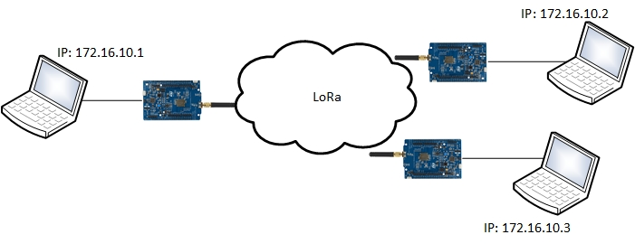
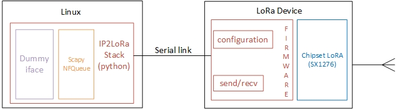
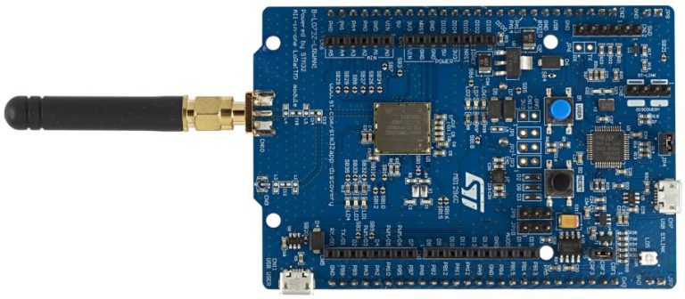
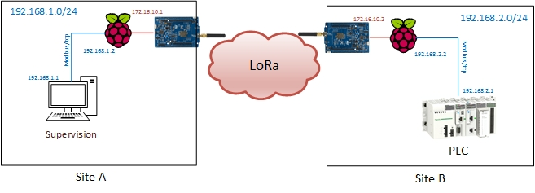
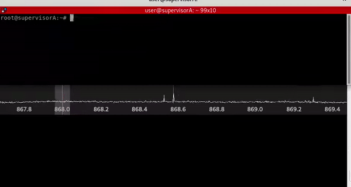
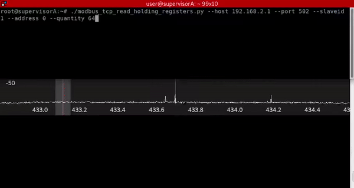
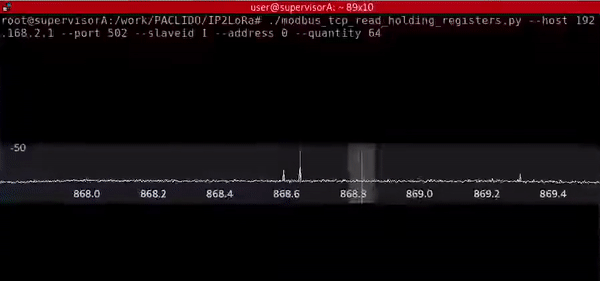

IP2LoRa : A diverted use of LoRa to build your wireless IP link over kilometres
===============================================================================

*by Flavian Dola, Vulnerability Researcher [@_ceax](https://twitter.com/_ceax)*

This article intends to describe both our experiment and software development to achieve IP tunnelling over LoRa. We made this work in order to improve our knowledge and to test the limitation of such technology.

Please note that the software is a proof of concept and provided “as is”. It is made available for use at your own risk. Also, you must be aware of frequency bands regulation (e.g. in France: https://www.arcep.fr), and duty cycle limitation. Later, we share a few words about this aspect.


# Introduction

Large industrial installations have a common problem. How can we link information system devices when they are separated by many kilometres? 

Resolving this problem leads to buy and deploy very expensive solutions like: 
* Dedicated fibre or optical lines
* Proprietary radio modems
* And so on…

The purpose of this article is to show how we can use the Internet of Things (IoT) radio communication LoRa, to make a “low-cost” IP link. To achieve this, we developed a software called IP2LoRA. This project is publicly available on [github](https://github.com/airbus-cyber/IP2LoRa).

We illustrate how this “low-cost” solution could substitute an expensive one in some specific usage context. For example, we will see that we can link two remote ICS installations by relying on Modbus over IP2LoRA.

Nowadays, LoRa (“Long Range”) radio communication is used extensively. This radio modulation technique was designed by Semtech to fill the following IoT needs:

* A long range communication
* A small amount of data to convey
* Being as cost effective as possible

LoRa communication uses free licensing ISM band: 433MHz, 868 MHz in Europe and 915 MHz in USA. These frequency channels are mainly used by other daily life devices like: Home automation devices, remote controllers, heating systems, alarm systems. To deal with all these interferences LoRa uses “Spread Factor” modulation to perform long range communication in this context.

At Airbus CyberSecurity, we contribute to many projects involving IoT technologies. As a result, we have the opportunity to deal with some LoRa devices in our lab. We also notice that many customers buy expensive solutions to link industrial systems that are thousands of miles apart. With all this information in mind, would it be possible to use LoRa technology to build a lowcost IP link?

# Overview



*Figure 1: IP2LoRa overview*

In this project, our objective is to link computers or networks using IP protocol through the LoRa node devices. We developed IP2LoRa in order to be compatible with most of the LoRa boards used. That’s why many functionalities are ensured on the computer side because we want to minimise the work performed by LoRa devices. Moreover our tool will be easily portable to many devices. 

**Notice:**
IP2LoRa was developed to encapsulate IP frame to LoRa interface through RS link. So, most of IP2LoRa software components can be reused and easily adapted to encapsulate IP traffic to other communication media (Ex: serial bus)


# IP2LoRa



*Figure 2: IP2LoRa software architecture*

# Lora Device

Our first experiments are based on a development board provided by STMicroelectronics: [B-L072Z-LRWAN1](https://www.st.com/en/evaluation-tools/b-l072z-lrwan1.html)



*Figure 3: B-L072Z-LRWAN1 development board*

The *B-L072Z-LRWAN1* includes a STM32L072CZ microcontroller and SX1276 transceiver for LoRa communication.

STMicroelectronics provides libraries and related programs to develop on the board. This “LoRaWan software expansion” can be downloaded at https://www.st.com/en/embedded-software/i-cube-lrwan.html. Also, we rely on the Keil software development environment to compile and flash the board. All instructions are available for downloading [at the following link](https://www2.keil.com/stmicroelectronics-stm32/mdk).

In the “LoRaWan software expansion” there are many examples that we can adapt to our needs. For example, the PingPong project sends “PING” through LoRa radio communication and expects to receive a “PONG” message back. Then the result is printed to the serial link.

Based on this example, we have built our own firmware with these capabilities:
1. A serial link between our computer and the *B-L072Z-LRWAN1* which is used as a “Control/Command”
2. A LoRa payload size increased from 64 bytes to 255 bytes
3. To modify and set new LoRa configuration “on the fly” (without reboot or re-flash)
4. The possibility to use different frequency channels both for RX and TX

This firmware can be downloaded [here](https://github.com/airbus-cyber/IP2LoRa/tree/main/firmware/B-L072Z-LRWAN1).

In order to flash the *B-L072Z-LRWAN1*, you just need to copy/paste it to the fake embedded drive. After waiting for some seconds, press the reset button of the board.

# IP2LoRa Stack

As previously mentioned, we want to minimise functionalities embedded in LoRa devices. Thus, most of the features are implemented on host/Linux side by ip2lora.py.

At the time of writing this blog, the IP2LoRa stack is based on python3.

*IP2LoRa* creates a dummy interface and assigns it an IP address (Ex: 172.16.10.1) with a network mask /28. Please note that all of the other *IP2LoRa* nodes we want to communicate with, will be on the same subnetwork. *IP2LoRa* also adds static fake MAC addresses to force the kernel to send data to our dummy interface for contacting others *IP2LoRa* devices.

Every IP frames targeting Lora/IP network are caught with NFQueue/Scapy utility and then serialised before sending through the LoRa radio communication. 

If needed, *IP2LoRa* have the ability to:

* Compress IP frame. Actually it uses the zlib compression algorithm
* Compress IP and TCP header using the ROHC library 
* Cipher traffic. As a Proof of Concept, a simple xor is actually implemented


# Limitations
Currently, the LoRa Media Access method implemented can be compared to Ethernet. In summary, when a device sends an *IP2LoRa* frame, it has to wait for a one-time slot plus a random time before it can send again. So, collisions and packet losses can occur. These problems cannot be spotted because the SX1276 module is not able to listen and transmit data at the same time due to a half-duplex connection. But an upper layer like TCP can ensure reliable messaging. Consequently, we highly recommend not to perform multiple communication on *IP2LoRa* link because these collisions drastically degrade the network performance.


# Test and performance

As expected, the available bandwidth is highly linked to the Spreading Factor, bandwidth and coderate parameters.

During our tests we get the following ping results:
```
SF:7 - bandwidth:125kHz – coderate: 4/5
64 bytes from 192.168.2.1: icmp_seq=1 ttl=63 time=605 ms

SF:8 - bandwidth:125kHz – coderate: 4/5
64 bytes from 192.168.2.1: icmp_seq=1 ttl=63 time=808 ms

SF:9 - bandwidth:125kHz – coderate: 4/5
64 bytes from 192.168.2.1: icmp_seq=4 ttl=63 time=1249 ms

SF:10 - bandwidth:125kHz – coderate: 4/5
64 bytes from 192.168.2.1: icmp_seq=1 ttl=63 time=2060 ms

SF:11 - bandwidth:125kHz – coderate: 4/5
64 bytes from 192.168.2.1: icmp_seq=1 ttl=63 time=4158 ms

SF:12 - bandwidth:125kHz – coderate: 4/5
64 bytes from 192.168.2.1: icmp_seq=1 ttl=63 time=7534 ms
```
We successfully established TCP connections over IP2Lora. For example, we tested well-known services such as Modbus TCP, HTTP, TELNET and SSH. Even if these connections are slow due to high latency, it works well. This gives us a nostalgic and happy feeling to remember the nineties’ network communications.

We have to mention that, due to high latency and legislation, usages of such solutions are restricted to some specific cases and cannot be compared to WiFi networks for example. We will describe a use case a later in this blog.


# Duty cycle conformity

In order to comply with the radio band regulation, we must take into account the duty cycle. In summary, the duty cycle is about 1 % in 868 Mhz frequencies, and 10 % in 433 Mhz frequencies. It means you have to wait one hour to send a new frame if the duration of the previous transmission is 36 seconds for duty cycle of 1% (868MHz). For a duty cycle of 10% (433 Mhz) you just have to wait 6 minutes.

In our experiment we can send about 0x40 TCP payload bytes’ length in 400 ms. So, in 868MHz we can transmit about 5.7 kBytes/h, and 57kBytes/h in 433Mhz.

This restriction widely impacts the use cases of our *IP2LoRA* implementation. Nevertheless, we keep in mind some suitable customer cases for such a deployment. For example, when this link is exclusively dedicated to gain non critical supervision and monitoring values of industrial process (Ex: using ModBus TCP).


# Example: Modbus over IP2LoRa

In this chapter, we want show that our solution could be deployed in some industrial use cases. Assume the two following points:

* We are faced by 2 industrial manufacturing sites separated by several hundred metres, whereas one site needs to get some supervision value from the second. 
* Telemetry data is accessed through a ModBus/TCP.

Here is an overview of this use case:


*Figure 4: Modbus over IP2LoRa*

Below is the list of used material:

* 2 Raspberry PI (Act as gateway)
* 2 B-L072Z-LRWAN1
* 1 PLC (Act as Modus/TCP server)
* 1 PC with Modbus/TCP client (Act as supervision server)

Here is the IP2LoRa configuration on the RaspberryPi from site A:

*config_st_A.py:*
```python
device = "B-L072Z-LRWAN1"
ip_address = "172.16.10.1"
tty = "/dev/ttyACM0"
rohc_compression = False
compress_mode ="zlib"
cipher_mode = "xor"
cipher_key = b"\x01\x02\x03\x04\x05\x06\x07\x08\x09\x0a\x0b\x0c\x0d\x0e\x0f"
channelRx = 868300000
channelTx = 868000000
SF = 7
TxPower = 2 # 14 max
bandwidth = 0 # 0:125kHz, 1:250kHz, 2:500kHz, 3: Reserved
coderate = 1  # 1:4/5, 2:4/6, 3:4/7, 4:4/8
preambleLen = 8
mtu = 128
maxLoraFramesz = 255
```

Here is the script to start *IP2LoRa*:
```bash
#!/bin/sh

IP_LORA_A=172.16.10.1
IP_LAN_A=192.168.1.2
NET_LAN_A=192.168.1.0
MASK_LAN_A=24

IP_LORA_B=172.16.10.2
IP_LAN_B=192.168.2.2
NET_LAN_B=192.168.2.0
MASK_LAN_B=24

# flush iptables rules
iptables -F
iptables -t nat -F


# ensure no previous running instance
./stop_ip2lora.sh 2>/dev/null && sleep 5

# start IP2Lora
echo "Starting IP2Lora..."
./ip2lora.py -d config_st_A.py > /tmp/ip2lora.log 2>&1 &
echo $! > /var/run/ip2lora.pid

sleep 10

# activate forwarding
echo 1 > /proc/sys/net/ipv4/ip_forward

# Add route to site B network
route add -net $NET_LAN_B/$MASK_LAN_B gw $IP_LORA_B
```

The *IP2LoRa* settings of the Raspberry Pi from site B is quite similar. We are taking care to modify IP address and switch frequencies for channel RX/TX:

```python
[…]
ip_address = "172.16.10.2"
channelRx = 868000000
channelTx = 868300000
[…]
```
Then we set up the IP parameters with a starting script. If needed, we can add SNAT rules if our PLC do not support multiple route (which is often the case).

```bash
# activate NAT (PLC may already have another default gateway)
iptables -t nat -A POSTROUTING -d 192.168.2.1 -j SNAT --to-source $IP_LAN_B
```

All the above scripts and configuration can be found in our [github project](https://github.com/airbus-cyber/IP2LoRa/tree/main/examples/modbus), in the “examples” folder. At the end, you will also retrieve Modbus TCP client and server programs.

Here is (an animated gif with) the *B-L072Z-LRWAN1* in action:


*Figure 5: Modbus over IP2Lora using B-L072Z-LRWAN1 interface*

Please see below, the same request with an identical configuration but through WisDuino interfaces:


*Figure 6: Modbus over IP2Lora using WisDuino interface*

The same request on LoStick interfaces:



*Figure 7: Modbus over IP2Lora using LoStick interface*

# What’s next

IP2LoRa was developed to improve our knowledge around the LoRa technology. In the meantime, it allows us to challenge such a protocol. All source code of this project is publicly available on github. We also plan to deliver our source code for B-L0172Z-LRWAN1 soon. 

Here is a list of additional features that might be added in a near future:

* Add support to others LoRa devices:
    * [LoStick](https://ronoth.com/products/lostik) (In progress)
    * [WisDuino](https://store.rakwireless.com/products/rak811-lpwan-evaluation-board) (In progress)
    * [RNode](https://unsigned.io/product/rnode/)
    * And more
* Add a *Duty Cycle* restrictive option in order to ensure the radio regulation is respected
* Add support of 2 simultaneous Lora Device to ensure Full Duplex Lora communication
* Improve media access (collision avoidance/detection…)

This is an open source project. Any contributions, bug reports, ideas are very welcome. So feel free to contribute at https://github.com/airbus-cyber/IP2LoRa .

Similar projects are available, and we encourage people to take a look and test them at the same time. (Ex: https://unsigned.io)